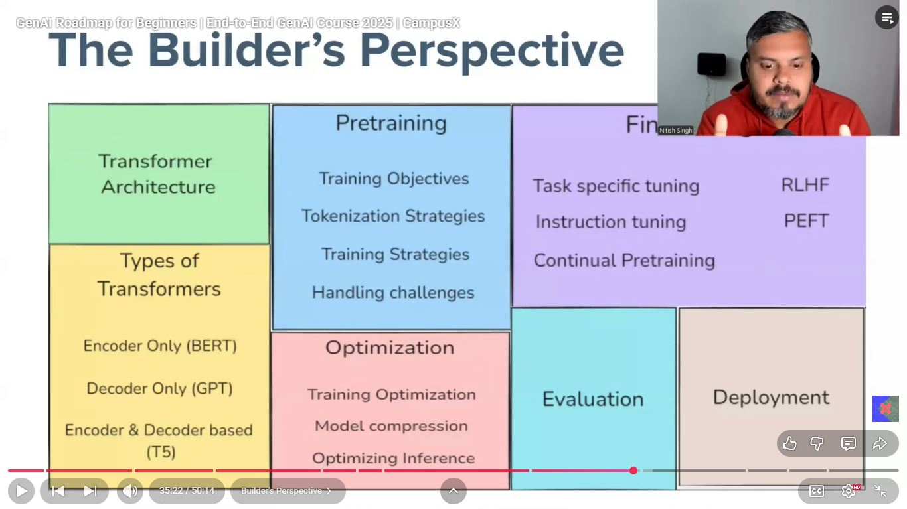
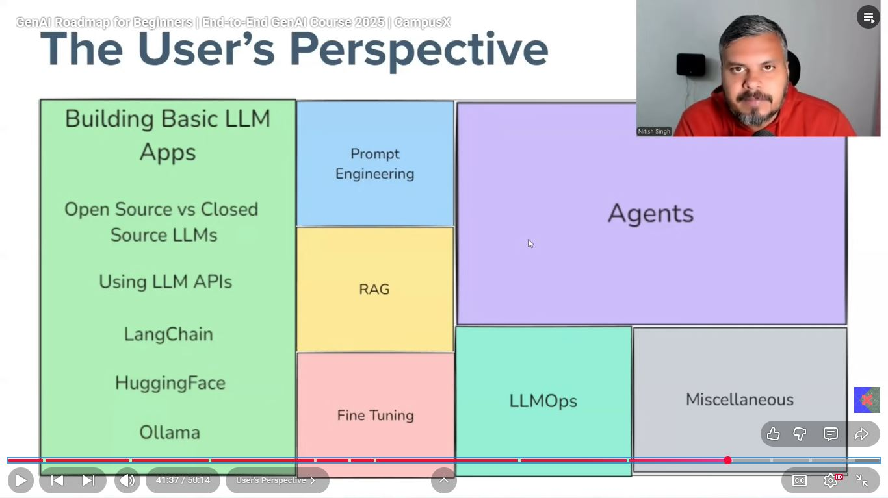

# Day_001 | 🚀 GenAI Roadmap for Beginners: End-to-End GenAI Course 2025

## 1. Course Overview and Vision

### 💡 The Transformation
This end-to-end course provides a clear, structured roadmap for absolute beginners to become proficient Generative AI Developers/Engineers by 2025. You will progress from foundational concepts to deploying real-world GenAI applications.

### 🎯 Key Learning Outcomes (KLOs)
Upon completion, you will be able to:
* **Understand** the core principles of AI, Machine Learning (ML), Deep Learning (DL), and Generative AI (GenAI).
* **Master** the Python ecosystem for GenAI development (NumPy, Pandas, PyTorch/TensorFlow).
* **Implement** state-of-the-art models like LLMs (Large Language Models), GANs, and Diffusion Models.
* **Apply** advanced techniques like Prompt Engineering and Retrieval-Augmented Generation (RAG).
* **Build** and **Deploy** complete GenAI applications using modern frameworks (e.g., LangChain/LlamaIndex, FastAPI).
* **Address** ethical considerations and Responsible AI practices in GenAI projects.

### 🗓️ Course Duration and Format
| Detail | Value |
| :--- | :--- |
| **Total Duration** | [Insert Weeks/Months, e.g., 20 Weeks] |
| **Instructional Hours** | [Insert Total Hours, e.g., 120 Hours] |
| **Format** | [Insert Format, e.g., Live Sessions / Self-Paced Modules / Hybrid] |
| **Expected Start Date** | [Insert Date, e.g., January 15, 2025] |

## 2. Prerequisites and Target Audience

### 👤 Target Audience
This course is perfect for:
* Absolute beginners with no prior AI/ML experience.
* Software Developers looking to transition into GenAI.
* Data Analysts/Scientists seeking to specialize in Generative Models.
* Students interested in a future-proof tech career.

### ✅ Prerequisites
* **Basic Computer Literacy:** Ability to navigate an operating system and install software.
* **Programming:** **No prior AI knowledge is required**, but a basic understanding of any programming language (preferably Python syntax) is highly recommended. *(A dedicated Python fundamentals module will be included.)*
* **Mathematics:** Basic high-school level algebra and a willingness to learn fundamental concepts of probability and linear algebra.

## 3. End-to-End Course Modules (The Roadmap)

The course is divided into four main phases, guiding you from fundamental knowledge to end-to-end deployment.

| Phase | Module Title | Key Topics Covered |
| :--- | :--- | :--- |
| **PHASE 1: Foundation** | **Module 1: Python and ML Fundamentals** | Python (Data Structures, OOP), NumPy, Pandas, Basic Statistics, Intro to ML/DL/GenAI. |
| | **Module 2: Deep Learning Essentials** | Neural Networks, Forward/Backward Propagation, Activation Functions, Optimizers (Gradient Descent), PyTorch/TensorFlow Basics. |
| **PHASE 2: Core GenAI** | **Module 3: Introduction to Large Language Models (LLMs)** | Transformer Architecture (Attention Mechanism), LLM Types (GPT, BERT, Llama), Pre-training vs. Fine-tuning. |
| | **Module 4: Prompt Engineering Mastery** | Zero/Few-shot learning, Chain-of-Thought (CoT), Advanced prompting techniques, Prompt Injection/Safety. |
| | **Module 5: Vector Databases and RAG** | Vector Embeddings, Vector Search, Retrieval-Augmented Generation (RAG) architecture, Tools (e.g., ChromaDB, Pinecone). |
| **PHASE 3: GenAI Engineering** | **Module 6: GenAI Frameworks (LangChain/LlamaIndex)** | Building chains/pipelines, Agents and Tool use, Memory integration, Customization. |
| | **Module 7: Multimodal & Other GenAI Models** | Introduction to GANs, VAEs, Diffusion Models (DALL-E, Midjourney), Text-to-Image/Video principles. |
| | **Module 8: Model Customization & Optimization** | Fine-tuning (full vs. parameter-efficient methods like LoRA), Quantization, Model Evaluation Metrics (BLEU, ROUGE). |
| **PHASE 4: Deployment & Ethics** | **Module 9: End-to-End Project Deployment** | Backend with FastAPI/Flask, Containerization (Docker), Cloud Deployment (e.g., AWS/GCP/Azure setup). |
| | **Module 10: Responsible AI & Future Trends** | Bias, Fairness, Privacy (data leakage), Hallucinations, AI Governance, Agentic AI, and industry trends for 2026. |

## 4. Assessment and Projects

### 📝 Assessment Structure
The course emphasizes practical application. Your final grade/certificate qualification will be based on:

* **Weekly Quizzes (20%):** To test theoretical understanding.
* **Module Assignments (30%):** Hands-on coding tasks for each module.
* **Capstone Project (50%):** A mandatory end-to-end project.

### 🏆 Capstone Project: End-to-End GenAI Application
You will select **one** of the following projects (or propose a new one):
1.  **RAG-Powered Chatbot:** Build a GenAI application that answers questions based on a proprietary document set using a Vector Database and RAG.
2.  **Code Generator:** Create an agent that takes a natural language request and generates a specific code snippet or script.
3.  **Image Captioning/Generation:** Develop a simple application leveraging a Diffusion Model API to generate images from text prompts.

## 5. Resources and Tools

| Category | Tools & Libraries Covered |
| :--- | :--- |
| **Core Language** | Python 3.x |
| **Frameworks** | PyTorch / TensorFlow, Hugging Face Transformers |
| **LLM Tools** | LangChain / LlamaIndex, OpenAI API, Gemini API, Cohere API |
| **Data & Vectors** | NumPy, Pandas, Vector Databases (e.g., ChromaDB) |
| **Deployment** | FastAPI, Docker, [Specific Cloud Platform] |
| **Version Control** | Git and GitHub |

---

## Images

<!--  -->