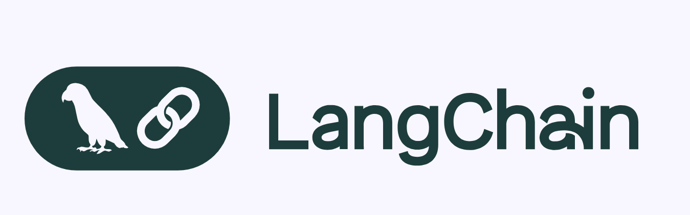
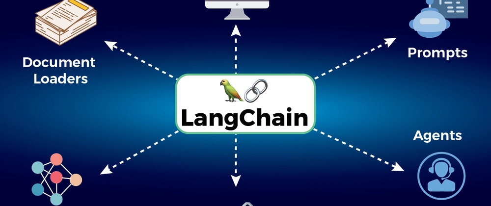
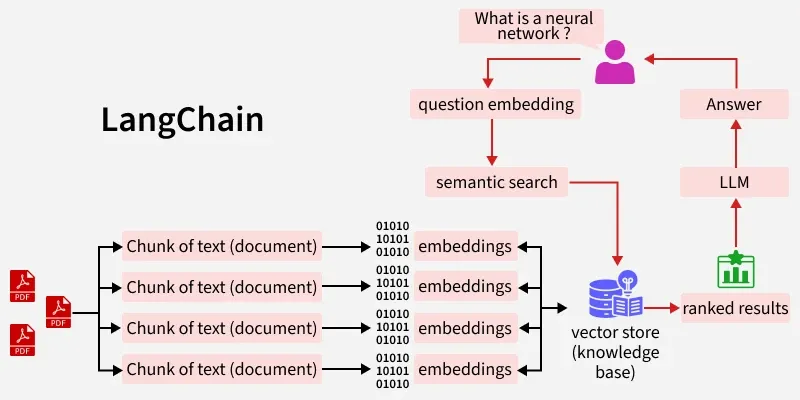

# Day_002 | LangChain

LangChain is an open-source **framework** designed to simplify the development of applications powered by Large Language Models (LLMs). It provides a set of tools and abstractions that make it easy to **connect LLMs to external data sources** (like documents and databases) and **allow LLMs to interact with their environment** (like calling APIs or performing computations).

The core idea is to *chain* together various components (LLMs, prompts, data retrieval, etc.) to create sophisticated, context-aware applications like smart chatbots, advanced QA systems, and autonomous agents.

---

## What LangChain Does (Why Use It)

| Feature | Description |
| :--- | :--- |
| **Context Awareness** | It allows you to feed external data (private documents, web pages, code) to the LLM, enabling it to generate answers based on **current, specific information** that wasn't in its original training data. |
| **Composability** | It provides **modular components** (abstractions) that you can easily combine and reuse, dramatically reducing the boilerplate code required to build complex LLM workflows. |
| **Agentic Behavior** | It empowers LLMs to use **tools** (APIs, databases, search) and autonomously decide the sequence of steps needed to accomplish a complex user request. |

---

## 3 Main Components (The Abstractions)

While LangChain is composed of many modules (Models, Prompts, Memory, Indexes, etc.), the three components that define the flow and functionality of a LangChain application are the **Runnables**, **Chains**, and **Agents**.

### 1. Runnables
The **fundamental building block** of LangChain. A Runnable is any object that can accept an input and return an output, often allowing for async, batch, and streaming execution. They are composable using the **LangChain Expression Language (LCEL)** (e.g., the pipe operator `|`).

* **Examples:** LLMs, Prompts, Output Parsers, Tools, Retrievers, and even Chains themselves.

### 2. Chains
A **sequence of Runnables** that are executed in a specific, predetermined order. They allow you to combine multiple steps into a single, reusable workflow.

* **Function:** Handles a multi-step process where the output of one component feeds directly into the input of the next.
* **Example:** A Chain that takes a user query, inserts it into a **Prompt Template**, and passes the full prompt to an **LLM** for generation.

### 3. Agents
A dynamic system where the LLM acts as the **reasoning engine** (the "brain") to decide the sequence of actions. Unlike Chains, Agents don't follow a fixed path; they use the context and available **Tools** to decide *what to do next* in a loop until the goal is achieved. 

* **Function:** Enables complex, non-deterministic workflows like performing a web search, running a calculator, and then answering the final question.

---

## Fundamental Concepts

LangChain's components are typically categorized into the following:

| Component Category | Description |
| :--- | :--- |
| **Models** | The interfaces for calling various LLMs (GPT-4, Gemini, Claude) and **Embedding Models** (used to convert text into vector representations). |
| **Prompts** | Classes for creating and managing **Prompt Templates**, allowing for dynamic, reproducible, and structured input to the LLMs. |
| **Retrievers/Indexes** | Tools for loading, transforming, and searching over external data. This includes **Document Loaders**, **Text Splitters**, **Vector Stores**, and **Retrievers** used in RAG. |
| **Memory** | Components that manage the history of a conversation, allowing an LLM to maintain **context** across multiple turns in a chat. |
| **Tools** | Functions or APIs that an **Agent** can call to interact with the real world (e.g., weather API, Google Search, code execution). |

---

## Retrieval-Augmented Generation (RAG) with LangChain

**RAG** is the process of retrieving relevant external information and injecting it into the LLM's prompt to ground its response, thereby improving accuracy and reducing hallucinations. LangChain makes building RAG pipelines straightforward. 

### The RAG Steps in LangChain:

1.  **Loading & Splitting:** Use a **Document Loader** (e.g., `PyPDFLoader`) to ingest data and a **Text Splitter** (e.g., `RecursiveCharacterTextSplitter`) to break it into small, semantically meaningful **Documents** (chunks).
2.  **Embedding & Storage:** Use an **Embedding Model** (e.g., OpenAIEmbeddings) to convert these text chunks into **Vector Embeddings**, and store them in a **Vector Store** (e.g., ChromaDB, Pinecone).
3.  **Retrieval:** When a user asks a question, a **Retriever** performs a similarity search in the Vector Store to find the top $k$ most relevant Document chunks.
4.  **Generation (The Chain):** A **Chain** combines the user's original question with the retrieved documents into a well-crafted prompt, which is then sent to the LLM to generate the final, informed answer.

---

## Agent Concept Using LangChain

An Agent in LangChain is essentially an LLM combined with the logic to decide which **Tools** to use and in what order to achieve a goal.

### Agent Architecture:

1.  **User Input:** The user provides a complex task (e.g., "What's the weather in Tokyo and what's the capital of France?").
2.  **The LLM/Agent (The Reasoner):** The LLM receives the input, its own system instructions, and the description of the available **Tools** (e.g., a "weather\_api" tool and a "search\_database" tool).
3.  **Action Selection:** The LLM internally reasons (using a methodology like **ReAct**) and decides the best *first step*. It might output an **Action** saying: "I need to call the `weather_api` tool with argument `Tokyo`."
4.  **Tool Execution:** The Agent Executor runs the `weather_api` tool, which returns an **Observation** (e.g., "The weather is 15°C and raining").
5.  **Loop:** The Agent Executor feeds the Observation back to the LLM. The LLM then reasons on the new information and decides the *next step* (e.g., "Now I will use the `search_database` tool for the capital of France").
6.  **Final Response:** Once the LLM has all the necessary information, it formulates and returns the final, synthesized answer to the user.

---

## **1. What is LangChain?**

**LangChain** is a **framework for building applications powered by Large Language Models (LLMs)**. It helps developers go beyond simple text generation by connecting LLMs with external data, APIs, and logic.

Think of it as **a toolkit for turning LLMs into real-world applications** like chatbots, question-answering systems, summarizers, or multi-step reasoning tools.

Key points:

* Written in **Python** (also supports JavaScript)
* Integrates with **OpenAI GPT**, **Hugging Face models**, and other LLMs
* Provides tools for **data retrieval, memory, reasoning, and chaining multiple steps**

---

## **2. Why LangChain?**

LLMs alone are great at text generation but limited in:

* Accessing **real-time or private data**
* Performing **multi-step reasoning**
* Managing **stateful conversations or memory**
* Interacting with **APIs or databases**

LangChain solves this by providing abstractions for:

* Chaining operations (prompt → LLM → tool → next prompt)
* Connecting to external data sources
* Adding memory and reasoning
* Structuring applications around LLMs

---

## **3. The 3 Main Components of LangChain**

1. **LLMs (Language Models)**

   * The engine for text generation or understanding.
   * Examples: GPT-4, GPT-3.5, Llama, Mistral.
   * Handles natural language processing tasks.

2. **Prompts / Prompt Templates**

   * Structured instructions given to the LLM.
   * Helps **standardize input** and **dynamically inject variables**.
   * Example: “Summarize the following text: {text}”

3. **Chains**

   * Chains **link multiple LLM calls or actions together**.
   * Enables **multi-step reasoning** (e.g., generate a summary, then translate it, then create bullet points).

---

## **4. Fundamental Concepts in LangChain**

* **Memory**: Enables LLMs to **remember previous interactions**, making chatbots stateful.
* **Tools**: External utilities like search engines, calculators, or APIs that the LLM can call.
* **Agents**: LLMs that **decide which tools to use and in what order**, essentially acting autonomously.
* **Vector Stores**: Databases to store embeddings for **semantic search**.

---

## **5. RAG (Retrieval-Augmented Generation)**

**RAG** is a core concept in LangChain for **knowledge-heavy applications**.

* **Problem:** LLMs have limited context length and may not “know” the latest info.
* **Solution:** Combine retrieval of relevant documents with generation.

**Workflow:**

1. Convert your documents into **embeddings**.
2. Store them in a **vector database**.
3. When a query comes, **retrieve the most relevant docs**.
4. Feed those docs to the LLM to **generate an informed answer**.

**Use case:** Question-answering over private company docs, Wikipedia search assistants, etc.

---

## **6. Agents Using LangChain**

Agents are **autonomous LLM applications that can plan and act** using multiple tools.

**Key points:**

* Agents **decide dynamically** what to do next.
* Use **Tools** (search APIs, calculators, databases).
* Use **LLM reasoning** to choose steps in a sequence.

**Example:** A travel planning agent:

1. LLM decides: “I need weather info → use weather API”
2. LLM decides: “I need flight info → call flight API”
3. Summarizes results for the user

LangChain provides **built-in agent types** like:

* `ZeroShotAgent` – chooses tools based on instructions without prior examples
* `ConversationalAgent` – remembers conversation context

---

### ✅ **Summary Table**

| Concept         | Purpose                                         |
| --------------- | ----------------------------------------------- |
| LLM             | Generates or understands text                   |
| Prompt Template | Structures input for the model                  |
| Chain           | Connects multiple LLM calls/actions             |
| Memory          | Keeps context/state across interactions         |
| Tools           | External APIs or utilities LLM can use          |
| Agent           | Autonomously plans & executes tasks using tools |
| RAG             | Retrieves relevant data to enhance generation   |

---

## Images

