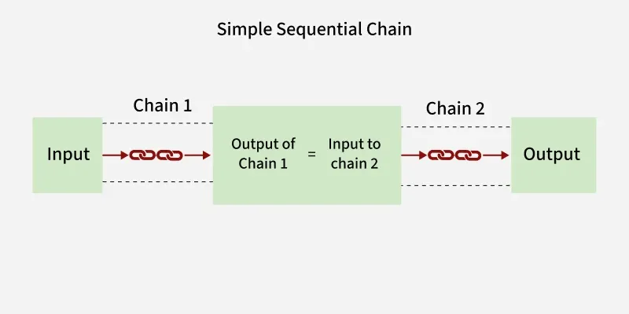

# Day_009 | 🔗 Basic of Chains in LangChain

In LangChain, a **Chain** is a sequence of components (Runnables) that are executed in a particular, fixed order to achieve a complex goal. Chains allow you to go beyond a single LLM API call by combining prompts, models, retrievers, parsers, and other tools into a reusable, logical workflow.

The modern way to build chains is using the **LangChain Expression Language (LCEL)**, which treats every component as a `Runnable` object that can be composed using the pipe operator (`|`).

-----

## Types of Chain Composition

Chains can be classified based on how the flow of data is managed: sequentially, in parallel, or conditionally.

### 1\. Sequential Chains

Sequential chains are the most common type, where the output of one step is directly used as the input for the next step. They are used to break a large task down into smaller, verifiable sub-tasks.

| Type | Description | Key Concept | LCEL Operator |
| :--- | :--- | :--- | :--- |
| **Simple Sequential** | A strictly linear pipeline where the output of step $N$ becomes the *single* input for step $N+1$. No explicit management of multiple inputs/outputs. | **Linear Pipeline:** Input flows directly from one component to the next. | **Pipe (`|`)** |
| **Complex Sequential** | A more general sequential structure that allows for **multiple inputs and outputs** at each step. This requires explicit mapping of variables between components. | **Multi-Input/Output Mapping:** Used when a later step needs both the original input *and* an intermediate result. | Combination of **Pipe (`|`)** and explicit `dict` passing. |

**Example of Simple Sequential Chain (LCEL):**

1.  **Generate a concept:** `user_input | concept_prompt | llm` $\rightarrow$ `concept_text`
2.  **Critique the concept:** `concept_text | critique_prompt | llm` $\rightarrow$ `final_critique`

### 2\. Parallel Chains

Parallel chains execute multiple components or sub-chains *simultaneously* on the same input. This is primarily used to speed up workflows when tasks are independent.

  * **How it works:** The initial input is passed to several independent branches at the same time. All branches execute concurrently, and their individual outputs are collected and aggregated into a single dictionary or object.
  * **Key Component:** **`RunnableParallel`**
  * **Use Case:** **Retrieval-Augmented Generation (RAG):** When a user asks a question, you might query a vector database *and* run a basic web search simultaneously, then aggregate both results before sending them to the final LLM for synthesis.

**Example of Parallel Execution (LCEL):**

```python
combined_info = RunnableParallel({
    "summary": summary_chain,
    "keywords": keyword_extraction_chain,
    "sentiment": sentiment_analysis_chain,
})
# Runs all three chains concurrently on the same initial input
```

### 3\. Conditional Chains (Routing)

Conditional chains introduce **branching logic** based on the input or the result of a previous step. Instead of following a fixed sequence, the flow is dynamically decided at runtime.

  * **Key Concept: Router Chain**
      * The **Router** (usually an LLM or a simple `RunnableLambda` function) analyzes the input.
      * It decides which pre-defined **Destination Chain** is most appropriate.
      * It routes the input to that specific chain, skipping all others.
  * **Use Case:** Building a **multi-purpose bot**. If the input is about "math," route it to a `CalculatorChain`. If it's about "philosophy," route it to a `PoetChain`.
  * **Modern LCEL Implementation:** Often achieved using the `.with_fallbacks()` or `.pick()` methods on a Runnable, or by using the LangGraph library for complex stateful logic.

**Example of Conditional Routing (Conceptual):**
$$\text{User Input} \xrightarrow[\text{Router LLM}]{\text{Routing Logic}} \begin{cases} \text{Chain A (Summarization)} & \text{if topic = 'document'} \\ \text{Chain B (Translation)} & \text{if topic = 'foreign language'} \\ \text{Default Chain} & \text{otherwise} \end{cases}$$

The **Router Chain** is one of the spectacular chain types you can learn to implement in your own projects. You can find more comprehensive examples and deep dives into all chain types in the following video: [Learning Langchain Series - Chain Types - Introduction](https://www.youtube.com/watch?v=y1Q8FgyGytY).

http://googleusercontent.com/youtube_content/1

---

## 🚀 **Basics of Chains in LangChain**

A **Chain** in LangChain is a pipeline that links together components—**LLMs, prompts, tools, retrievers, functions**, etc.—so data flows from one stage to the next.
Chains allow you to create **multi-step workflows**, logic, or automation around LLMs.

---

## ⭐ 1. What Are Chains?

A **Chain** takes **inputs**, processes them through one or more **steps**, and returns an **output**.

Simple example:

* **Prompt → LLM → Output**
* **User Query → Tool → LLM → Final Answer**
* **Prompt → LLM → Prompt → LLM → Output**

---

## ⭐ 2. Types of Chains

### ✔️ **A. Sequential Chains**

Run components **one after another**, passing output of one step as input to the next.

#### **Use cases**

* Multi-step reasoning
* Extract → transform → generate workflows
* Summarize → ask questions → refine

#### **Example**

```
input -> Step A -> Step B -> Step C -> output
```

#### **Python example**

```python
from langchain.chains import SequentialChain

chain = SequentialChain(
    chains=[chain1, chain2, chain3], 
    input_variables=["text"],
    output_variables=["final_output"]
)
```

---

### ✔️ **B. Parallel Chains**

Run multiple chains **simultaneously** (independent of each other), then combine results.

#### **Use cases**

* Generate multiple perspectives at the same time
* Run multiple LLMs or prompts in parallel
* Multi-extract summary + keywords + sentiment

#### **Concept**

```
           → chain A →
input  →   → chain B →   → merge results
           → chain C →
```

#### Example (conceptual)

```python
from langchain.chains import SimpleSequentialChain
from langchain.chains import ParallelChain

parallel = ParallelChain(
    branches={"summary": summary_chain, "keywords": keyword_chain}
)
```

---

### ✔️ **C. Conditional Chains (Router / Branching Chains)**

These choose **different sub-chains depending on logic**.

#### **Use cases**

* Tool selection
* Route questions: math questions → calculator, policy → LLM
* Use different prompts based on user input

#### **High-level idea**

```
if condition(input):
    run chain A
else:
    run chain B
```

#### Example

```python
from langchain.chains import ConditionalChain

router_chain = ConditionalChain(
    default_chain=general_chain,
    conditionals=[
        (lambda x: "math" in x["query"], math_chain),
        (lambda x: "translate" in x["query"], translate_chain)
    ]
)
```

---

## ⭐ 3. Other Useful Chain Types

### **1. LLMChain**

Simplest chain: **Prompt → LLM → Output**

```python
from langchain.chains import LLMChain
```

### **2. Transform Chain**

Apply custom Python logic between steps.

```python
def transform(inputs):
    return {"cleaned": inputs["text"].strip()}
```

### **3. Router Chain**

LLM-based routing to different chains (smart conditional chain).

### **4. SequentialChain (Simple + Standard)**

SimpleSequentialChain → passes only one output
SequentialChain → can manage multiple I/O variables

### **5. RetrievalQA Chain**

Use retrievers + LLM for question answering.

---

## ⭐ 4. Visual Comparison

| Chain Type               | Flow                      | Use Case                 |
| ------------------------ | ------------------------- | ------------------------ |
| **Sequential**           | A → B → C                 | Multi-step workflows     |
| **Parallel**             | A & B & C at same time    | Multi-output generation  |
| **Conditional / Router** | A **or** B based on logic | Decision-making, routing |
| **LLMChain**             | Prompt → LLM              | Basic LLM calls          |
| **TransformChain**       | Python fn → LLM           | Data preprocessing       |

---

## ⭐ 5. Example Workflow Using All Chains

**Problem:**
Take user question → Decide if it's math or text → Run appropriate chain → Output results + keywords in parallel.

**Flow:**

1. Conditional chain
2. Sequential chain
3. Parallel chain

```
User question → RouterChain → (math_chain OR text_chain)
                     ↓
            SequentialChain → "processed answer"
                     ↓
     ParallelChain → {keywords, summary}
```

---

## 🎯 Summary Cheat Sheet

| Concept               | Description                     |
| --------------------- | ------------------------------- |
| **Chain**             | Pipeline of steps around LLMs   |
| **Sequential Chain**  | Step-by-step execution          |
| **Parallel Chain**    | Multiple branches run together  |
| **Conditional Chain** | Branch selection based on rules |
| **Router Chain**      | LLM-powered routing             |
| **Transform Chain**   | Custom Python logic insertion   |

---

## Images


