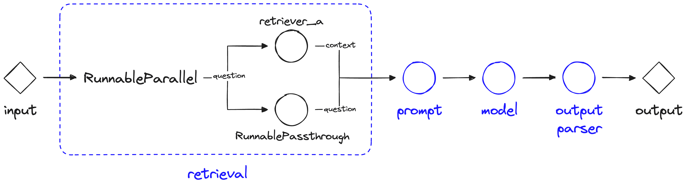
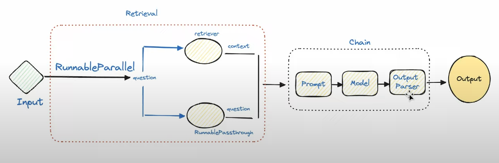
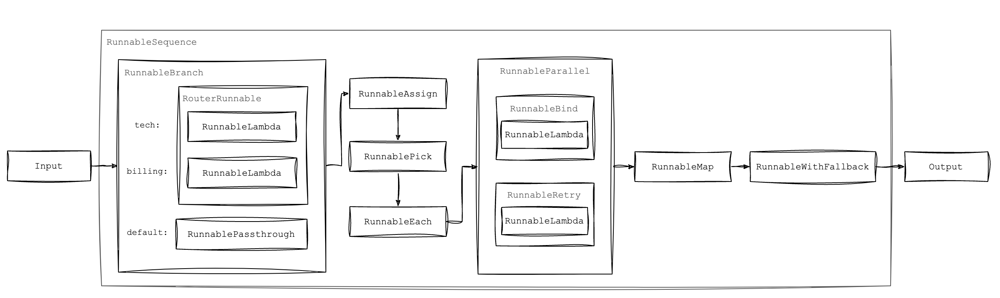

# Day_011 | 🏃 Two Main Categories of Runnables
The **Runnable** is the standardized interface and the fundamental building block of the LangChain Expression Language (LCEL). It allows all components—from models to custom code—to be chained together seamlessly using the pipe operator (`|`).

Runnables enable **composition**, **streaming**, **batch processing**, and **parallel execution** across any component that implements the interface.

-----

## 🏃 Two Main Categories of Runnables

In LangChain, runnables are generally categorized based on their role in an application:

### 1\. Task-Specific Runnables (Core Components)

These are the primary components of an LLM application that perform the actual workload (prompting, generating, retrieving). They implement the `Runnable` interface so they can be easily integrated into a pipeline.

| Type | Description |
| :--- | :--- |
| **Models** | LLMs and ChatModels (e.g., `ChatOpenAI`). They generate text completions or structured outputs. |
| **Prompts** | Prompt Templates (e.g., `ChatPromptTemplate`). They format input variables into the messages the model expects. |
| **Retrievers** | Components that fetch documents from a vector store (e.g., `vectorstore.as_retriever()`). |
| **Parsers** | Output Parsers (e.g., `StrOutputParser`). They transform the raw text response into structured data. |

### 2\. Primitive Runnables (Orchestration Logic)

These are specific utility classes used to structure the execution flow of the chain—handling sequencing, parallelism, branching, and data manipulation. They are the tools for sophisticated choreography.

| Primitive Runnable | Purpose | Key Functionality |
| :--- | :--- | :--- |
| **`RunnableSequence`** | **Sequential Flow** (The default of using `|`). Executes runnables one after another, where the output of $N$ becomes the input of $N+1$. | Forms linear chains: `prompt | model | parser`. |
| **`RunnableParallel` / `RunnableMap`** | **Parallel Execution** and Dictionary Construction. Executes multiple runnables concurrently on the same input and combines their outputs into a single dictionary. | Used when you need multiple results from one input (e.g., summarizing and extracting keywords simultaneously).  |
| **`RunnablePassthrough`** | **Data Preservation.** Passes the original input through unchanged to the next step, often while other processing occurs in parallel. | Essential for RAG, where you need the original user question for the final prompt *and* the retrieved context documents. |
| **`RunnableLambda`** | **Custom Logic / Transformation.** Wraps any standard Python function (`def` or `lambda`) into a Runnable object. | Allows custom preprocessing (e.g., cleaning text) or post-processing (e.g., calculating word count) within a chain. |
| **`RunnableBranch`** | **Conditional Routing.** Implements logic similar to an `if/elif/else` statement, routing the input to different destination chains based on a runtime condition. | Used for building multi-purpose bots where the path depends on the user's intent. |

-----

## 💻 Implementation: How LCEL Utilizes Runnables

The pipe operator (`|`) is an implementation of **`RunnableSequence`**. When you write a chain using LCEL, you are automatically leveraging the Runnable interface:

$$
\text{Prompt} \xrightarrow{|} \text{Model} \xrightarrow{|} \text{Parser}
$$

This is the equivalent of:

```python
chain = RunnableSequence(prompt, model, parser)
```

The pipe operator automatically manages the input/output flow, ensuring the output type of the left-hand runnable matches the expected input type of the right-hand runnable. This strong composability is the main reason runnables are the core of modern LangChain development.

This video provides an excellent introduction to how you can start building with the core runnable types like `RunnableLambda` and `RunnablePassthrough`. [LangChain Runnables Tutorial - YouTube](https://www.youtube.com/watch?v=bJNOZSffpRc)

http://googleusercontent.com/youtube_content/3


---

## 🌟 **LangChain Runnables — Overview**

In LangChain, **Runnables** are the core building block of the **LangChain Expression Language (LCEL)**.
A runnable is **anything that can be executed**, transformed, or composed into a pipeline.

Runnables let you create chains such as:

* LLM → Parser
* Prompt → LLM → Output parser
* Multiple models combined
* Parallel or sequential pipelines

---

## ✔️ **Primitive Runnables**

Primitive runnables are the lowest-level runnable components.
They include:

### **1. `RunnableLambda`**

A runnable that wraps any Python function.

```python
from langchain.schema.runnable import RunnableLambda

double = RunnableLambda(lambda x: x * 2)
double.invoke(3)  # returns 6
```

---

### **2. `RunnableMap`**

Runs multiple runnables **in parallel**, returning a dictionary.

```python
from langchain.schema.runnable import RunnableMap

pipeline = RunnableMap({
    "upper": RunnableLambda(lambda x: x.upper()),
    "length": RunnableLambda(lambda x: len(x)),
})
pipeline.invoke("hello")
```

Output:

```python
{"upper": "HELLO", "length": 5}
```

---

### **3. `RunnableSequence` / `RunnablePassthrough`**

Runs steps **in order**, feeding output to the next step.

```python
from langchain.schema.runnable import RunnablePassthrough, RunnableLambda

pipeline = RunnablePassthrough() | RunnableLambda(lambda x: x**2)
pipeline.invoke(4)  # 16
```

---

### **4. `RunnableBranch`**

Conditional routing between runnables.

```python
from langchain.schema.runnable import RunnableBranch

branch = RunnableBranch(
    (lambda x: x > 10, RunnableLambda(lambda x: "big")),
    (lambda x: True, RunnableLambda(lambda x: "small"))
)

branch.invoke(5)   # "small"
```

---

### **5. `RunnableParallel`**

Executes multiple runnables at once (like RunnableMap but looser).

---

### **6. `RunnableEach`**

Runs a runnable on **each element of a list**.

```python
RunnableEach(RunnableLambda(lambda x: x * 2)).invoke([1, 2, 3])
```

Output:

```python
[2, 4, 6]
```

---

## ✔️ **Major Types of Runnables**

LangChain exposes several high-level runnable types built on top of primitives.

---

### **1. LLM Runnables**

Every LLM is a runnable.

```python
from langchain_openai import ChatOpenAI
llm = ChatOpenAI(model="gpt-4o-mini")
llm.invoke("Hello!")
```

---

### **2. Prompt Template Runnables**

Prompt templates become runnables automatically.

```python
from langchain.prompts import ChatPromptTemplate

prompt = ChatPromptTemplate.from_messages([
    ("user", "Tell me a joke about {topic}")
])
```

---

### **3. Output Parser Runnables**

These convert raw LLM output to structured data.

```python
from langchain.output_parsers import JsonOutputParser
parser = JsonOutputParser()
```

---

### **4. RunnableParallel / RunnableMap**

Parallel execution as shown above.

---

### **5. Runnable APIs for Tools & Agents**

Tools become runnables.

```python
from langchain.tools import tool

@tool
def add(x: int, y: int):
    return x + y
```

---

## ✔️ **LCEL Pipeline Example (Putting it all together)**

```python
from langchain.prompts import ChatPromptTemplate
from langchain_openai import ChatOpenAI
from langchain.output_parsers import StrOutputParser

prompt = ChatPromptTemplate.from_messages([
    ("user", "Write a poem about {topic}")
])

llm = ChatOpenAI(model="gpt-4o-mini")
parser = StrOutputParser()

chain = prompt | llm | parser

chain.invoke({"topic": "the ocean"})
```

---

## ✔️ **High-Level Summary**

### **Primitive Runnables**

| Runnable Type                      | Purpose                       |
| ---------------------------------- | ----------------------------- |
| `RunnableLambda`                   | Wrap any Python function      |
| `RunnableMap`                      | Parallel dictionary execution |
| `RunnableSequence` / `Passthrough` | Step-by-step pipelines        |
| `RunnableBranch`                   | Conditional logic             |
| `RunnableEach`                     | Apply over lists              |
| `RunnableParallel`                 | Parallel pipelines            |

### **Higher-level Runnables**

| Category         | Examples                               |
| ---------------- | -------------------------------------- |
| LLM              | `ChatOpenAI`, `ChatAnthropic`, etc     |
| Prompt templates | `ChatPromptTemplate`, `PromptTemplate` |
| Output parsers   | `StrOutputParser`, `JsonOutputParser`  |
| Tools & Agents   | custom tool definitions                |

---

## Images


