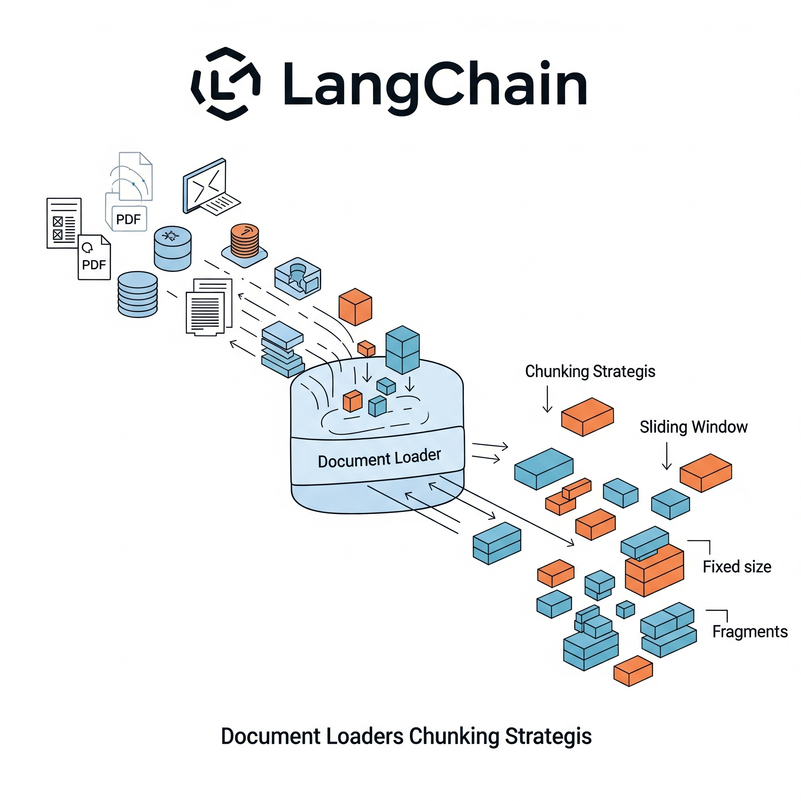
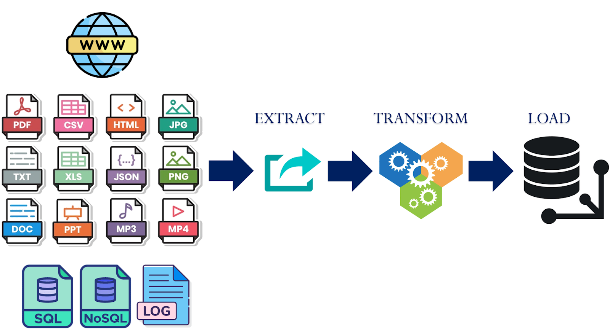
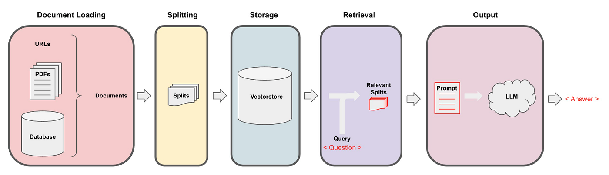
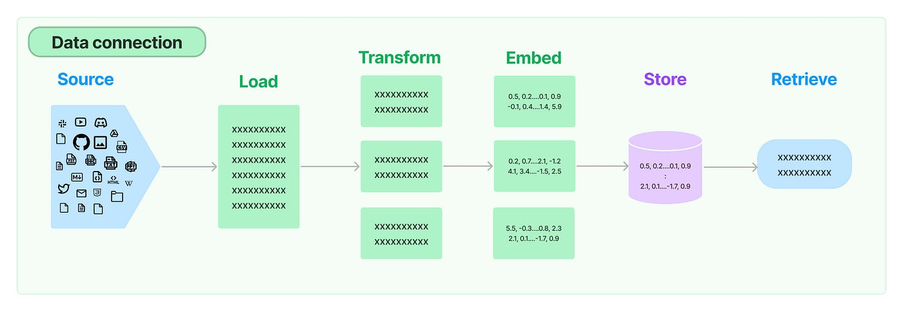
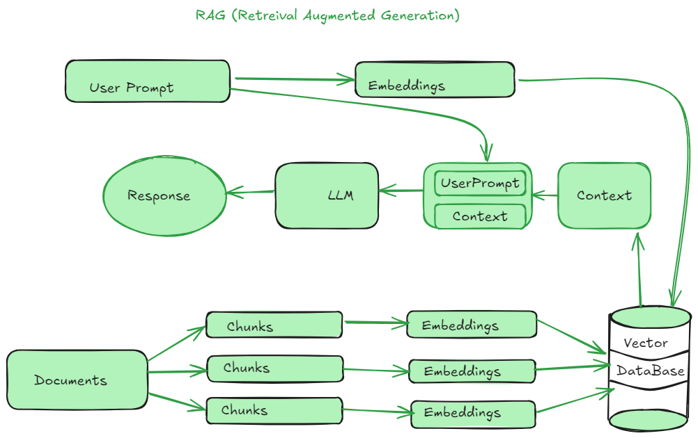

# Day_012 | 📂 Document Loaders in LangChain

**Document Loaders** are the essential first step in a Retrieval-Augmented Generation (RAG) pipeline. They are responsible for ingesting data from various sources (files, databases, APIs) and converting them into a standardized format: the **LangChain `Document` object**.

A `Document` object consists of two key components:

1.  **`page_content`**: A string containing the textual content.
2.  **`metadata`**: A dictionary containing auxiliary information about the source (e.g., file path, URL, page number, table name).

All document loaders implement the `BaseLoader` interface, which provides common methods like `.load()` (loads all data at once) and `.lazy_load()` (streams data incrementally, useful for large files).

-----

## Most Common Document Loaders and Their Variants

| Loader | Use Case | Key Features/Variants | Pros | Cons/Limitations |
| :--- | :--- | :--- | :--- | :--- |
| **`TextLoader`** | Plain text files (`.txt`, `.log`, `.md`). | Simple and fast. Ideal for transcripts or raw code. | **Reliable** (simple format), very fast. | Only works for unformatted text. |
| **`PyPDFLoader`** | Loading content from PDF files. | Uses the `pypdf` library. Variants: `PyPDFLoader` (default, page-by-page), `UnstructuredPDFLoader` (better layout parsing). | Splits document by **page**, preserving page numbers in metadata for citation. | Poor performance with scanned PDFs or complex, multi-column layouts; relies solely on text extraction. |
| **`CSVLoader`** | Tabular data in CSV format. | Loads each **row** as a separate `Document`. Supports specifying a `metadata_columns` list. | Converts structured table data into individual, retrievable text chunks. | Each row becomes one chunk, which may lack context from other rows or the header. |
| **`WebBaseLoader`** | Static HTML content from URLs. | Uses **BeautifulSoup** for parsing. Extracts text content while ignoring boilerplate HTML. | Easy way to ingest blogs, articles, and documentation from the web. | Cannot handle dynamic, JavaScript-rendered websites (requires advanced variants like `SeleniumURLLoader`). |
| **`JSONLoader`** | JSON files (including `.jsonl`). | Requires a **JQ query** (`jq_schema`) to target specific arrays/objects within the JSON file for extraction. | Provides fine-grained control over which parts of the JSON become a `Document`. | Requires knowledge of JQ syntax; complexity increases with nested JSON structures. |
| **`DirectoryLoader`** | Loading **multiple files** from a directory. | Uses a `glob` pattern (e.g., `*.pdf`) and a `loader_cls` argument to specify the correct loader for matched files. | Automates bulk ingestion across large document sets. | Loads everything into memory at once unless configured for `lazy_load` or multithreading. |

-----

## 🚧 Alternatives and Custom Document Loaders

### Alternatives to LangChain Loaders

While LangChain offers over 200 integrations, certain alternatives or specialized tools are sometimes preferred:

| Alternative/Tool | Focus | Pros/Cons |
| :--- | :--- | :--- |
| **LlamaIndex** | **Data Framework.** | **Pro:** Offers more specialized data connectors and indexing strategies, often seen as simpler for pure RAG data ingestion tasks. **Con:** Less focus on the *agent* orchestration aspect compared to LangChain. |
| **Unstructured** | **Preprocessing Tool.** | **Pro:** Excellent at advanced parsing of complex documents (PDFs, images, MS Office) by leveraging techniques like OCR and layout detection. **Con:** Adds an external dependency and potentially more complex setup/cost. |
| **Direct Libraries** | **Raw APIs.** | **Pro:** Highest control over data extraction, minimal overhead. **Con:** Requires manual code to generate the LangChain `Document` object and handle all metadata extraction. |

### Building a Custom Document Loader

If LangChain doesn't have a loader for your specific proprietary format (e.g., a custom XML file or a niche database format), you must create a custom loader.

1.  **Inherit:** Create a new class that inherits from `BaseLoader`.
2.  **Implement:** Implement the `load()` method (and optionally `lazy_load()`).
3.  **Return:** The `load()` method **must** return a `list` of `Document` objects.

<!-- end list -->

```python
from langchain_core.document_loaders import BaseLoader
from langchain_core.documents import Document

class CustomXMLLoader(BaseLoader):
    def __init__(self, xml_path):
        self.xml_path = xml_path

    def load(self):
        # 1. Logic to read the custom XML file
        # 2. Extract content and metadata
        # 3. Create the Document object
        content = "..." # Extracted text
        metadata = {"source": self.xml_path, "type": "xml"}
        return [Document(page_content=content, metadata=metadata)]
```

If you're interested in seeing a practical demonstration of how these different document loaders are used in a real-world scenario, you might find this video helpful: [Document Loaders Explained: TextLoader, PDF, Web, CSV, Directory](https://www.youtube.com/watch?v=yOPrp99b9iU).

http://googleusercontent.com/youtube_content/4

---


## 📘 **Document Loaders in LangChain — Complete Guide**

Document Loaders in LangChain are utilities that **read external data sources** (files, websites, databases, APIs) and convert them into standardized **Document** objects.

A **Document** typically contains:

```python
{
   "page_content": "... text ...",
   "metadata": {...}
}
```

These loaders are foundational in building retrieval-augmented generation (RAG) pipelines.

---

## 🧩 **1. Common Document Loaders**

Below are the most commonly used and essential LangChain document loaders.

---

### ⭐ 1.1 **TextLoader**

Loads text from plain `.txt`, `.md`, `.log`, `.ini`, `.cfg`, etc.

#### ✔ Features

* Extremely fast
* Minimal dependencies
* Good for small to medium-sized text files

#### ✔ Example

```python
from langchain_community.document_loaders import TextLoader
loader = TextLoader("file.txt")
docs = loader.load()
```

#### ✔ Pros

* Lightweight
* Easy to customize
* Good for preprocessing pipelines

#### ❌ Cons

* Cannot parse structure (headings, sections)
* No auto-chunking or parsing

#### 🔄 Alternatives

* `UnstructuredFileLoader` (for structure extraction)
* `PDFasTextLoader` (if text extracted from PDF)

---

### ⭐ 1.2 **PyPDFLoader**

The most widely used PDF loader in LangChain.

#### ✔ Features

* Extracts text page-by-page
* Includes page metadata
* Works with scanned PDFs if OCR enabled (`pytesseract` required)

#### ✔ Example

```python
from langchain_community.document_loaders import PyPDFLoader
loader = PyPDFLoader("document.pdf")
docs = loader.load()
```

#### ✔ Pros

* Stable, reliable
* Metadata includes page numbers
* Compatible with chunking

#### ❌ Cons

* PDF parsing inconsistencies (depending on PDF encoding)
* No layout preservation
* Tables may be lost

#### 🔄 Variants

| Loader                  | Feature                         |
| ----------------------- | ------------------------------- |
| `PDFMinerLoader`        | Better text extraction accuracy |
| `PyMuPDFLoader`         | Faster + layout-aware           |
| `PDFPlumberLoader`      | Better tables extraction        |
| `UnstructuredPDFLoader` | OCR + layout parsing            |

---

### ⭐ 1.3 **Web-Based Loaders**

Used for scraping websites or fetching URLs.

#### ✔ Popular Types

| Loader                  | Description                                |
| ----------------------- | ------------------------------------------ |
| `UnstructuredURLLoader` | Extracts text using Unstructured           |
| `SeleniumURLLoader`     | Loads JS-heavy websites                    |
| `AsyncChromiumLoader`   | Fast browser-based scraping                |
| `PlaywrightURLLoader`   | Similar to Selenium with better JS support |
| `WebBaseLoader`         | Simple HTML scraping                       |

#### ✔ Example

```python
from langchain_community.document_loaders import WebBaseLoader
loader = WebBaseLoader("https://example.com")
docs = loader.load()
```

#### ✔ Pros

* Automates web scraping
* JS-enabled loaders handle SPAs
* Extract metadata like URL, titles

#### ❌ Cons

* Slow for JS-rendered pages
* CAPTCHAs may block access
* Requires browser dependencies

#### 🔄 Alternatives

* **Firecrawl**, **Crawlera**, **Scrapy**, **BeautifulSoup**, **Playwright** manually

---

### ⭐ 1.4 **CSVLoader**

Loads tabular data from `.csv`.

#### ✔ Features

* Treats each row as a Document
* Includes row metadata

#### ✔ Example

```python
from langchain_community.document_loaders import CSVLoader
loader = CSVLoader("data.csv")
docs = loader.load()
```

#### ✔ Pros

* Simple structured data ingestion
* Good for RAG over tabular datasets

#### ❌ Cons

* Converts rows to text → may lose table context
* Not ideal for large CSVs (>1M rows)

#### 🔄 Variants

* `PandasCSVLoader` (more flexibility)
* `DataFrameLoader` (load from pandas)

---

## 🗂 2. Other Popular Loaders (Quick Reference)

| Loader                             | Use case                    |
| ---------------------------------- | --------------------------- |
| **Docx2txtLoader**                 | MS Word `.docx`             |
| **UnstructuredWordDocumentLoader** | Doc/Docx with structure     |
| **MarkdownLoader**                 | `.md` files                 |
| **EmailLoader**                    | `.eml`, `.msg`              |
| **JSONLoader**                     | JSON datasets               |
| **YoutubeLoader**                  | Extract video transcripts   |
| **S3FileLoader**                   | Load files from AWS S3      |
| **GitLoader**                      | Load source code from repos |
| **DirectoryLoader**                | Load many files at once     |

---

## 🧬 3. Unstructured Loaders (Very Important)

Unstructured is a powerful parsing framework used heavily in LangChain.

### Popular variants:

* `UnstructuredFileLoader`
* `UnstructuredMarkdownLoader`
* `UnstructuredHTMLLoader`
* `UnstructuredPDFLoader`

### ✔ Pros

* Extracts semantic structure
* Preserves headers, paragraphs, lists
* OCR support

### ❌ Cons

* Heavy dependencies
* Slower
* Requires API key for hosted Unstructured API

---

## ⚙️ 4. Custom Document Loader (Build Your Own)

LangChain allows creating custom loaders by inheriting from:

```python
from langchain.document_loaders import BaseLoader
```

### ✔ Example: Custom API Loader

```python
from langchain.document_loaders import BaseLoader
from langchain.schema import Document
import requests

class MyAPILoader(BaseLoader):
    def __init__(self, endpoint):
        self.endpoint = endpoint

    def load(self):
        data = requests.get(self.endpoint).json()
        text = data["content"]
        metadata = {"source": self.endpoint}
        return [Document(page_content=text, metadata=metadata)]
```

Usage:

```python
loader = MyAPILoader("https://api.example.com/data")
docs = loader.load()
```

### Use cases:

✔ Proprietary business APIs\
✔ Databases\
✔ Internal file formats (XML, CAD, proprietary formats)\
✔ Audio transcription pipelines

---

## 📊 5. Pros & Cons Summary Table

| Loader        | Pros                   | Cons                    |
| ------------- | ---------------------- | ----------------------- |
| TextLoader    | Fast, simple           | No structure            |
| PyPDFLoader   | Stable, page metadata  | Poor layout parsing     |
| PyMuPDFLoader | Fast + layout          | Requires PyMuPDF        |
| Unstructured  | Best structure parsing | Slow, heavy             |
| DOCX Loaders  | Good for office files  | Format inconsistencies  |
| WebLoaders    | Scrape any website     | CAPTCHAs, JS issues     |
| CSVLoader     | Good for tables        | Loses format            |
| YoutubeLoader | Easy transcripts       | Depends on availability |

---

## 🧱 6. Limitations of LangChain Document Loaders

1. **Parsing accuracy varies by file type**
2. **Heavy loaders require many dependencies**
3. **Large documents must be chunked manually**
4. **Table extraction is generally poor**
5. **PDF layout remains a challenge across all loaders**
6. **JS-heavy site scraping requires Selenium/Playwright**

---

## 🔁 7. Alternatives Outside LangChain

You can integrate these parsers manually and feed outputs into LangChain:

### PDFs:

* **pdfplumber**
* **PyMuPDF**
* **Apache Tika**

### Websites:

* **BeautifulSoup**
* **Scrapy**
* **Playwright**

### Documents:

* **textract**
* **docx2txt**
* **Apache POI** (Java)

### OCR:

* **Tesseract**
* **Google Vision**
* **AWS Textract**

---

## 🧩 8. Recommended Loader Selection

| Scenario             | Recommended Loader             |
| -------------------- | ------------------------------ |
| PDF with simple text | PyPDFLoader                    |
| PDF with tables      | PDFPlumberLoader               |
| PDF with layout      | PyMuPDFLoader                  |
| Scanned PDF          | UnstructuredPDFLoader + OCR    |
| HTML webpage         | UnstructuredHTMLLoader         |
| JS-rendered webpage  | PlaywrightURLLoader            |
| Large directory      | DirectoryLoader                |
| Tabular data         | CSVLoader or DataFrameLoader   |
| Word Files           | UnstructuredWordDocumentLoader |
| Video transcripts    | YoutubeLoader                  |

---

## ✔️ Conclusion

LangChain provides a rich ecosystem of document loaders tailored for diverse data sources including files, web content, APIs, and structured datasets. Understanding their strengths and limitations helps you design more robust RAG, QA, and search applications.

## References
https://docs.langchain.com/oss/python/langchain/overview

## Images




