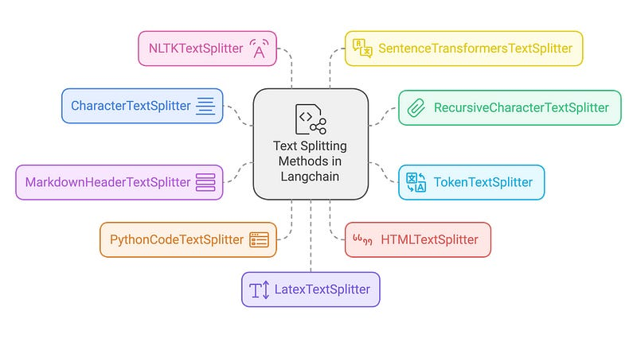
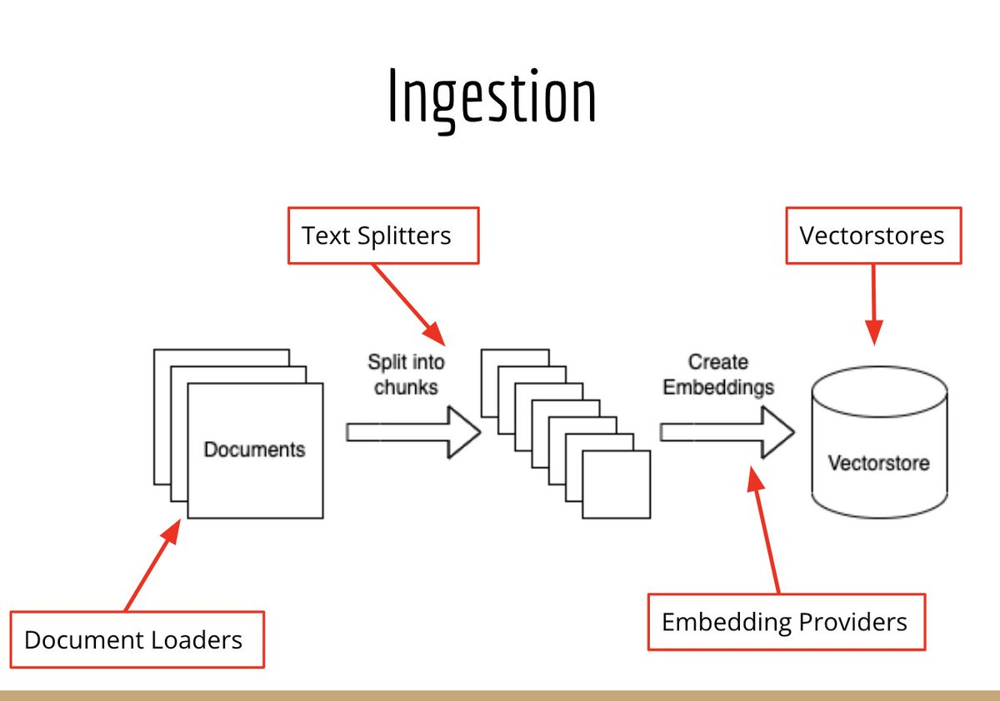
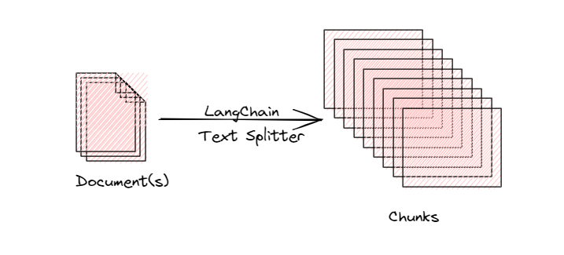

# Day_013 | 🔪 Text Splitters in LangChain

**Text Splitters** (often called "chunking" strategies) are one of the most critical components of a Retrieval-Augmented Generation (RAG) system. Their purpose is to break down large `Document` objects into smaller, digestible pieces, called **chunks**, that can be effectively embedded, stored, retrieved, and fit within the context window limits of an LLM.

### What & Why Text Splitting Matters

* **What:** A Text Splitter takes a long string of text and divides it into a list of smaller strings (`chunks`), often with a specified `chunk_size` and a `chunk_overlap` (the shared text between consecutive chunks to preserve context).
* **Why:**
    1.  **Context Window Limit:** Most LLMs (even large ones) have a finite context window (e.g., $128k$ tokens). Long documents must be chunked to fit.
    2.  **Retrieval Precision:** Searching over a vector store is more effective with smaller, topically focused chunks. Large, noisy chunks dilute the relevance of the retrieved information.
    3.  **Cost:** Sending smaller chunks to the LLM for response generation reduces token usage and API costs.

---

## Most Famous Splitting Techniques

LangChain groups splitting strategies based on the primary mechanism used to determine the boundaries.

### 1. Length-Based Splitting (Arbitrary)

This is the simplest and fastest method, focusing purely on size constraints.

| Technique | LangChain Class | Use Case | Limitation |
| :--- | :--- | :--- | :--- |
| **Character-Based** | `CharacterTextSplitter` | Short, unstructured text like chat logs, FAQs, or simple notes where speed and size consistency matter most. | **Brute Force:** May split sentences or paragraphs mid-way, resulting in semantically incoherent fragments. |
| **Token-Based** | `TokenTextSplitter` | Critical for models with strict token limits (e.g., older GPT models). Ensures chunks align exactly with the model's tokenizer. | Slower than character splitting because it requires invoking the tokenizer. Still ignores text structure. |

### 2. Text Structure-Based Splitting (Hierarchical)

This is the **default and recommended starting point** for most general-purpose RAG applications.

| Technique | LangChain Class | Use Case | Limitation |
| :--- | :--- | :--- | :--- |
| **Recursive Splitting** | `RecursiveCharacterTextSplitter` | Long-form content like articles, reports, books, or transcripts where maintaining context is vital. | **Pragmatic Default:** Slower than simple splitting due to recursive checks. Still a rule-based approach—it doesn't *understand* the meaning, just the formatting. |
| **How it Works:** It uses a prioritized list of separators (e.g., `["\n\n", "\n", " ", ""]`). It first tries to split by paragraphs (`\n\n`). If the resulting chunks are still too large, it tries the next separator (sentences, then words, then characters) until the chunk size constraint is met, preserving larger units of meaning whenever possible. |

### 3. Document Structure-Based Splitting (Format-Specific)

These techniques leverage a document's inherent formatting to create logical chunks.

| Technique | LangChain Class | Use Case | Limitation |
| :--- | :--- | :--- | :--- |
| **Markdown Headers** | `MarkdownHeaderTextSplitter` | Markdown documentation, blogs, or reports. | Only works on Markdown format; splitting is dictated strictly by header level (e.g., $\#$, $ \#\#$). |
| **Code Structure** | `Language` (with `RecursiveCharacterTextSplitter`) | Programming source code (Python, JavaScript, etc.). | Splits by logical units (functions, classes) to preserve code coherence. |

### 4. Semantic Meaning-Based Splitting (Advanced)

This approach focuses on meaning rather than syntax or size.

| Technique | Concept | Use Case | Limitation |
| :--- | :--- | :--- | :--- |
| **Semantic Chunking** | Divides text based on the **semantic similarity** of sentences. When the topic shifts significantly (low similarity between adjacent sentences/propositions), a new chunk boundary is created. | Technical papers, textbooks, or narrative documents where topic changes are the most important boundary. | **High Complexity/Cost:** Requires running an **Embedding Model** on every sentence and performing similarity analysis (e.g., clustering or peak detection). |

---

## 🏆 What Technique Is Best for Now and Why?

For the vast majority of RAG applications today, the recommended starting point is:

### **Best Technique: `RecursiveCharacterTextSplitter`**

#### Why It's the Default Winner:

1.  **Pragmatic Balance:** It offers the best trade-off between **context preservation** (by respecting paragraphs and sentences) and **chunk size control** (by recursively splitting when necessary).
2.  **General-Purpose:** It performs reasonably well across many types of documents (articles, reports, transcripts) that lack strict, predictable structural tagging (unlike Markdown or code).
3.  **Simplicity:** It requires minimal configuration beyond `chunk_size` and `chunk_overlap`.

### **When to Use Others:**

* **For Perfection/High Accuracy:** If RAG accuracy is paramount, migrate from `Recursive` to **Semantic Chunking** or **Document Structure-Based** splitters (`MarkdownHeaderTextSplitter`) to ensure logical boundaries are never broken.
* **For Speed/Simplicity:** Use `CharacterTextSplitter` for very short, unstructured inputs (e.g., short chat transcripts) where the semantic risk is low.

This video provides an excellent deep dive into the various chunking strategies available in LangChain for optimizing your RAG performance: [Chunking Strategies to Improve Your RAG Performance](https://www.youtube.com/watch?v=y1Q8FgyGytY).

---

## ✅ **What Are Text Splitters in LangChain?**

Text splitters are utilities that **break large documents into smaller chunks** so they can be used with LLMs for:

* Retrieval-Augmented Generation (RAG)
* Embedding generation
* Document indexing
* Summarization

Because LLMs typically have context limits and embeddings degrade with very long text, chunking is *essential*.

---

## ✅ **Why Do We Need Text Splitters?**

Text must be split for four main reasons:

1. **Token Limits**
   LLMs and embedding models cannot process arbitrarily long text.

2. **Embedding Quality**
   Long, multi-topic chunks → embeddings become “blurry” and less accurate.

3. **Efficient Retrieval**
   Smaller, coherent chunks allow the vector database to retrieve only what's relevant.

4. **Reduced Hallucination**
   Better chunking → better grounding in the right context.

---

## 🔥 **Major Splitting Techniques in LangChain**

## 1️⃣ **Length-Based Splitters**

Examples: `RecursiveCharacterTextSplitter`, `CharacterTextSplitter`, `TokenTextSplitter`

### **How they work**

* Split text based on **characters or tokens**.
* Define:

  * `chunk_size` (e.g., 500 tokens)
  * `chunk_overlap` (e.g., 50 tokens)
* Try to respect sentence/paragraph boundaries when possible (recursive splitter).

### **Use Cases**

* General-purpose RAG
* Unstructured or messy text
* Fast preprocessing
* Low complexity tasks

### **Limitations**

* Semantics are not understood
  (chunks may split in the middle of ideas)
* Sensitive to chunk size selection
  (too small = lose context, too big = poor retrieval)
* Not ideal for code or highly structured documents

---

## 2️⃣ **Text-Structured Splitters (Rule-Based / Format-Based)**

Examples:

* `MarkdownHeaderTextSplitter`
* `HTMLHeaderTextSplitter`
* `PythonCodeTextSplitter`
* `LaTeXTextSplitter`

### **How they work**

* Use the document’s **existing structure**:

  * Markdown headers
  * HTML tags
  * Code block definitions
  * LaTeX sections
* Produce chunks that follow the natural hierarchy of the document.

### **Use Cases**

* Well-structured content:

  * Docs
  * Wikis
  * Books
  * Codebases
* Better retrieval for structured or hierarchical text.

### **Limitations**

* Only works well if the input actually has structure.
* Might produce large chunks if a section is long.
* Not suitable for messy or mixed-format text.

---

## 3️⃣ **Document-Structured Splitters**

Examples:

* `PDFPlumberParser + splitter`
* `CSVLoader + CSVRowSplitter`
* `DocxSplitter`

### **How they work**

* First extract structure from complex documents:

  * Page boundaries
  * Rows
  * Columns
  * Slides
* Then chunk within that structure.

### **Use Cases**

* PDFs with multi-column or scanned layouts
* Spreadsheets used as knowledge sources
* PowerPoints or presentations
* Legal documents where page context matters

### **Limitations**

* Parsing PDFs is notoriously inconsistent.
* Requires the right loader + splitter combo.
* Output quality depends heavily on the document formatting.

---

## 4️⃣ **Semantic-Meaning-Based Splitters (Embedding-Based / AI-Based)**

Examples:

* `SemanticChunker` (LangChain)
* `Graph-based text segmentation`
* `TransformerSentenceSplitter`

### **How they work**

Uses **embeddings** to detect natural semantic boundaries:

* Compare similarity between sentences
* If similarity dips → likely a topic boundary
* Create chunks based on semantic coherence instead of size

### **Use Cases**

* Knowledge-heavy RAG systems (e.g., enterprise, legal, medical)
* Conversations or narrative text
* Long, complex documents with multiple themes
* When high retrieval accuracy is required

### **Limitations**

* Computationally expensive (embedding every sentence)
* Slower preprocessing
* Not ideal for extremely large corpora unless precomputed

---

## 🥇 **Which Technique Is Best Right Now?**

### ⭐ **Best Overall: Semantic Chunking**

If you want **accuracy**, **coherent retrieval**, and a modern RAG pipeline, semantic chunking performs the best in most scenarios.

#### **Why?**

* Produces **topic-preserving chunks**
* Less dependence on arbitrary chunk size
* Reduces retrieval noise
* Mitigates the need for excessive overlaps
* Improves grounding → reduces hallucination
* Works across structured and unstructured text

Semantic chunking aligns most closely with how language and ideas flow.

---

## 🧩 **But there is no “one-size-fits-all”**

Here’s a practical recommendation:

| Use Case                          | Best Splitter                                   |
| --------------------------------- | ----------------------------------------------- |
| Large RAG app / general knowledge | **Semantic Chunker + Recursive split fallback** |
| Code, Markdown, docs              | **MarkdownHeaderTextSplitter / CodeSplitters**  |
| PDFs, slides, tables              | **Document-structured splitters**               |
| Low-budget or very large datasets | **Length-based splitters**                      |

---

## 🎯 **Summary**

* **Text splitters** help manage long text for LLMs.
* Four main splitter types:

  * **Length-based** → simple, fast
  * **Text-structured** → good for markdown/code/docs
  * **Document-structured** → important for PDFs, tables
  * **Semantic-based** → best accuracy, preserves meaning
* **Best modern choice: Semantic Chunking**, especially for RAG.

---

## Images

