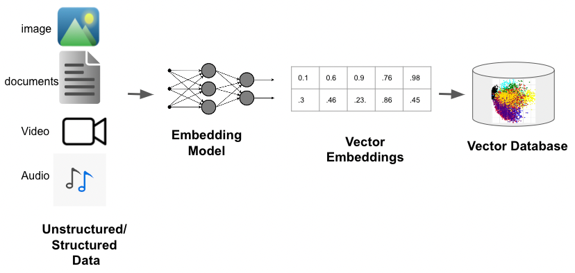
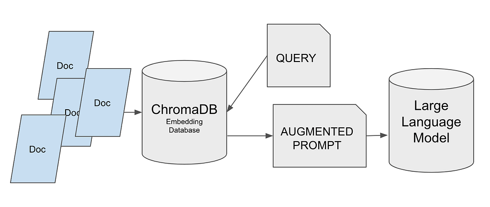
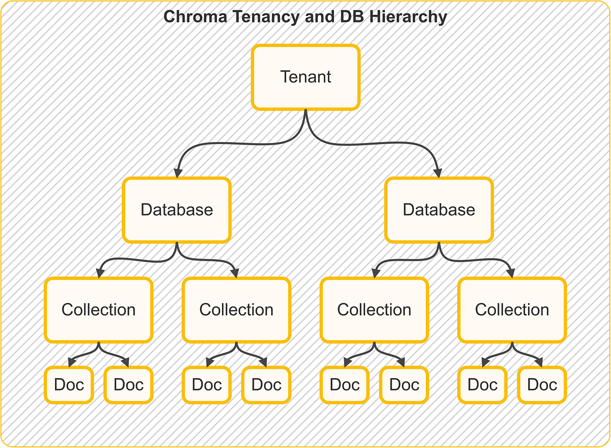

# Day_014 | 💾 Vector Stores in LangChain

A **Vector Store** (or Vector Database) is a specialized storage system designed to store numerical representations of data, known as **vector embeddings**, and efficiently perform **similarity searches** on them.

In LangChain, the `VectorStore` class provides a unified interface to interact with these systems, making them the backbone of **Retrieval-Augmented Generation (RAG)** workflows.


---

### The Role of Vector Stores in RAG

Vector stores are crucial because they enable Large Language Models (LLMs) to access, understand, and use external, proprietary, or timely information that they were not trained on.

1.  **Indexing Phase (Storing Data):**
    * **Document:** Your raw data (PDF, text, CSV, etc.) is loaded and split into small chunks (Documents).
    * **Embedding Model:** Each chunk is passed through an **Embedding Model** (e.g., OpenAI Embeddings, Gemini Embeddings, HuggingFace Embeddings), which converts the text into a dense vector (a list of floating-point numbers) that mathematically captures its semantic meaning.
    * **Vector Store:** The vector embedding and its original text chunk (along with any metadata) are stored and indexed by the vector store.
2.  **Query Phase (Retrieving Data):**
    * **User Query:** The user's question is also converted into a vector embedding using the *same* embedding model.
    * **Similarity Search:** The vector store uses a fast algorithm (usually Approximate Nearest Neighbor or ANN) to find the stored vectors that are **closest** (most similar) to the query vector based on distance metrics (e.g., Cosine Similarity or Euclidean Distance).
    * **Retrieval:** The retrieved chunks of text are then passed to the LLM as context for generating the final answer.


### Key Methods in the LangChain `VectorStore` Interface

LangChain standardizes the interaction with all vector stores, allowing you to easily swap providers with minimal code changes. The core methods include:

| Method | Purpose | Description |
| :--- | :--- | :--- |
| **`add_documents`** | Data Ingestion | Adds a list of `Document` objects (text and metadata) to the store, automatically generating and indexing their embeddings. |
| **`similarity_search`** | Retrieval | Performs a semantic search using a text query, returning the $k$ most relevant `Document` objects based on vector similarity. |
| **`as_retriever()`** | Abstraction | Converts the `VectorStore` instance into a `Retriever` object, which is a key Runnable in RAG chains. |
| **`delete`** | Data Management | Removes vectors (and their associated documents) from the store, typically by unique ID. |

### Popular Vector Store Integrations

LangChain supports a vast ecosystem of vector stores, suitable for different phases of development and scale requirements:

| Category | Example Providers | Pros | Cons/Use Case |
| :--- | :--- | :--- | :--- |
| **Local/In-Memory** | **FAISS**, **Chroma** | **Easiest setup**, free, excellent for local development, prototyping, and small datasets. | Limited scalability, tied to a single machine/process, maintenance required for persistence. |
| **Managed Cloud** | **Pinecone**, **Qdrant Cloud**, **Weaviate Cloud** | **Highly scalable**, reliable, no infrastructure maintenance, built for production traffic and speed. | Cost scales with data size and usage, vendor lock-in, requires API keys. |
| **Self-Hosted/OSS** | **Milvus**, **Weaviate**, **Qdrant**, **PGVector** (PostgreSQL extension) | Full control over infrastructure, open-source (no licensing fees), designed for large-scale production. | Requires dedicated infrastructure management, setup complexity is higher. |

### Choosing the Right Vector Store

The best choice depends on your project's needs:

* **Prototyping/Local Development:** Start with **Chroma** (for built-in persistence) or **FAISS** (for speed).
* **Production (Managed):** Use **Pinecone** or **Qdrant Cloud** for zero-maintenance scaling and high reliability.
* **Production (Self-Hosted):** Use **PGVector** (if you already use PostgreSQL) or **Milvus/Qdrant** (for maximum performance and features on massive datasets).


---

**Vector Stores in LangChain** are components that store **embeddings** (vector representations of text) and let you efficiently perform **similarity search** — a core part of retrieval-augmented generation (RAG), semantic search, and memory systems in modern LLM applications.

---

## 🔑 What Is a Vector Store?

A **vector store** holds high-dimensional vectors (embeddings) and supports:

* **Insertion** of vectors + metadata
* **Similarity search** (e.g., nearest neighbors)
* (Often) **filtering by metadata**

Embeddings typically come from an embedding model (OpenAI, Cohere, HuggingFace, etc.).

In LangChain, a vector store is an **abstraction/interface** with many concrete implementations (FAISS, Chroma, Milvus, Pinecone, Weaviate, Qdrant…).

---

## 🧠 Core Concept

**Workflow with a Vector Store:**

1. **Embed** your text/documents into vectors.
2. **Store** them in a vector store.
3. **Query** by embedding the user query and doing a similarity search.
4. Retrieve the **top N** relevant documents to feed into an LLM.

This powers RAG, chatbots that *know context*, semantic search UIs, and more.

---

## 🧱 LangChain Vector Store Components

LangChain provides connectors for many vector databases:

| Vector Store | In-Memory / Local  | Hosted / Clustered |
| ------------ | ------------------ | ------------------ |
| **FAISS**    | ✅                  | ❌                  |
| **Chroma**   | ✅                  | (optional)         |
| **HNSWLib**  | ✅                  | ❌                  |
| **Annoy**    | ✅                  | ❌                  |
| **Milvus**   | ❌                  | ✅                  |
| **Pinecone** | ❌                  | ✅                  |
| **Qdrant**   | ❌                  | ✅                  |
| **Weaviate** | ❌                  | ✅                  |
| **Redis**    | (with RedisSearch) | ❌/Limited          |

Each has different scalability, persistence, and performance traits.

---

## 🛠 Basic LangChain Usage (Python)

### 1) Embeddings

```python
from langchain.embeddings import OpenAIEmbeddings

embeddings = OpenAIEmbeddings()
```

### 2) Create a Vector Store

#### FAISS (local)

```python
from langchain.vectorstores import FAISS

docs = ["Hello world", "How are you?", "LangChain is cool"]
embeds = [embeddings.embed_text(d) for d in docs]

db = FAISS.from_embeddings(embeds, docs)
```

#### Chroma

```python
from langchain.vectorstores import Chroma

db = Chroma.from_texts(docs, embedding=embeddings)
```

#### Pinecone (hosted)

```python
import pinecone
from langchain.vectorstores import Pinecone

pinecone.init(api_key="YOUR_KEY", environment="env")
db = Pinecone.from_texts(docs, embeddings, index_name="myindex")
```

---

## 🔍 Querying the Vector Store

```python
query = "Tell me about LangChain"
results = db.similarity_search(query, k=3)
for r in results:
    print(r.page_content)
```

Some stores also support **filtered retrieval** using metadata.

---

## 🧩 Integrating with LLMs (RAG)

Typical pipeline:

1. **Store documents** in a vector store.
2. On user query:

   * Embed query
   * Retrieve similar docs
   * Feed docs + query to LLM for answer

Example:

```python
from langchain.chains import RetrievalQA
from langchain.llms import OpenAI

rqa = RetrievalQA.from_chain_type(
    llm=OpenAI(),
    retriever=db.as_retriever()
)

print(rqa.run("What is LangChain?"))
```

---

## 📌 Tips & Best Practices

### Choose the Right Store

* **FAISS / HNSWLib** for local experiments.
* **Chroma** for lightweight persistence + portability.
* **Pinecone / Qdrant / Milvus / Weaviate** for scalable production.

### Persist Your Data

Local stores like FAISS must be **saved/loaded** from disk.

```python
db.save_local("faiss_index")
db = FAISS.load_local("faiss_index", embeddings)
```

### Metadata Matters

Add metadata (source, title, doc id) so filtering later becomes powerful.

---

## 🧠 When to Use Vector Stores

✔ Semantic search\
✔ Retrieval-Augmented Generation (RAG)\
✔ Chatbots with context memory\
✔ Question answering over documents\
✔ Personalized assistants

---

## 📌 Summary

* **Vector Store** = database for embeddings + efficient similarity search.
* LangChain supports **many adapters** for both local and hosted vector databases.
* Key usage pattern: **embed → index → search → combine with an LLM**.

---

## References

- [Chroma-DB-Documents](https://docs.trychroma.com/docs/overview/getting-started)
- [Chroma-DB-Langchain](https://docs.langchain.com/oss/python/integrations/vectorstores/chroma)

---

## Images


