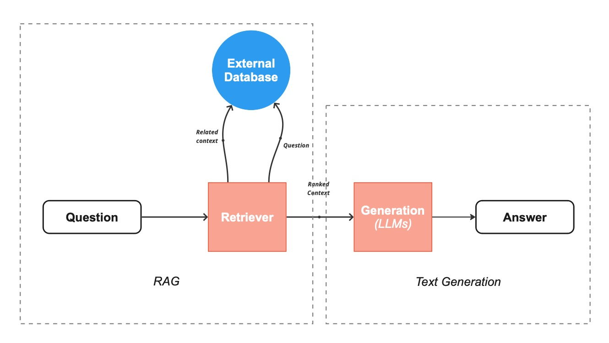
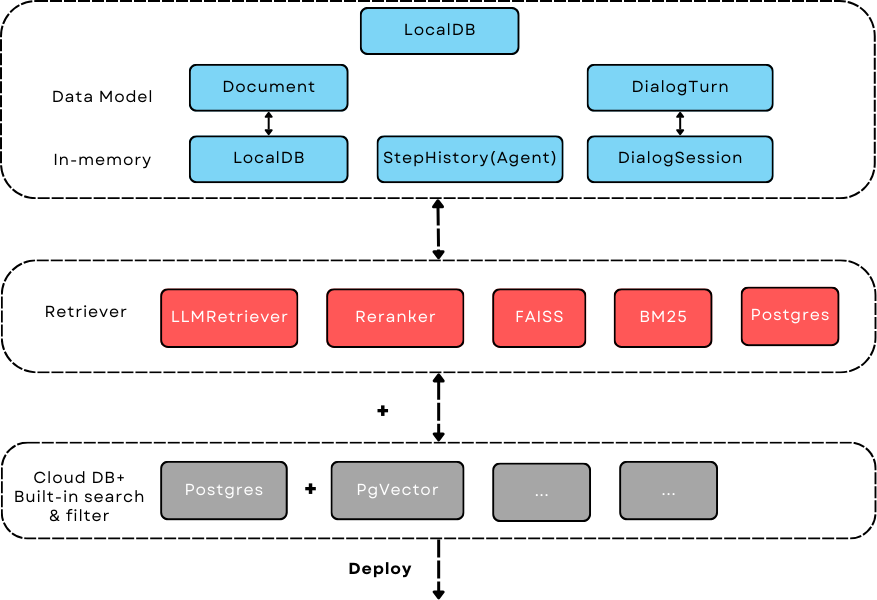
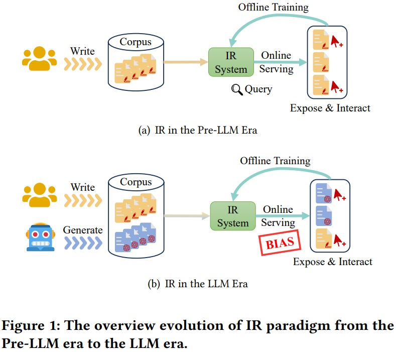
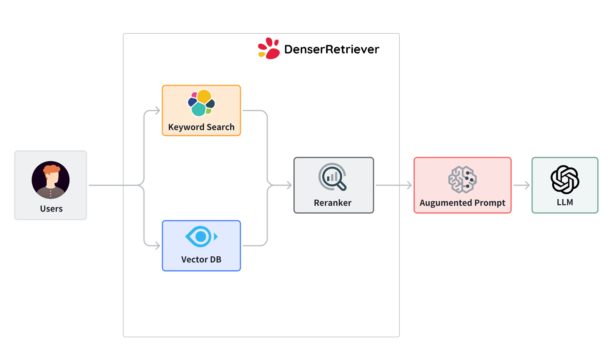

# Day_015 | 📚 Retrievers in LangChain: The Smart Librarian

In LangChain, a **Retriever** is a powerful interface that serves as the **smart librarian** for your Retrieval-Augmented Generation (RAG) system. Its primary job is to accept an unstructured query (the user's question) and return a list of relevant `Document` objects from a specific source.

Crucially, a Retriever is *more general* than a Vector Store. While a `VectorStore` (like Chroma or Pinecone) is often the **storage backbone**, the **Retriever** applies the logic, filtering, and pre/post-processing needed to ensure the fetched documents are truly the best context for the LLM.

### Key Features of a Retriever:

* **Standard Interface:** It is a `Runnable`, meaning it can be easily chained with prompts and models using LCEL (e.g., `retriever | prompt | model`).
* **Input:** An unstructured text query (string).
* **Output:** A list of `Document` objects (text chunks + metadata).

---

## Types of Retrievers and Their Trade-offs

Retrievers are categorized by the strategy they use to improve relevance and context.

| Retriever Type | Mechanism & Goal | Best Use Case | Problem/Limitation |
| :--- | :--- | :--- | :--- |
| **1. Standard VectorStore Retriever (Dense)** | Performs a **semantic similarity search** on document embeddings. **Goal:** Find content with similar *meaning* to the query. | **Starting point** for all RAG. High accuracy on paraphrased or nuanced queries. | **The "Small Chunk" Problem:** Small chunks are good for indexing but often lack the necessary surrounding context for the LLM to generate a full answer. |
| **2. Parent Document Retriever** | Indexes small, high-density chunks (for accurate search) but **retrieves the larger parent chunk or original document** (for full context). | Documents where small chunks lose vital context (e.g., policy documents, technical manuals). | **Increased Context Window Usage:** Retrieving larger documents can quickly exceed the LLM's token limit if not managed well. |
| **3. Self-Query Retriever** | Uses an LLM to parse the user's natural language query and **extract structured filters** (e.g., dates, authors, categories) to apply to the vector store's metadata. | Queries involving metadata filtering: e.g., "Tell me about papers on LLMs *published after 2024*." | **LLM Dependency:** Reliability depends on the LLM's ability to correctly parse and generate the structured filter, introducing potential failure points and latency. |
| **4. Multi-Query Retriever** | Uses an LLM to **generate multiple, slightly varied queries** from the original user query (Query Expansion). Retrieves documents for all variations, then merges the results. | Ambiguous or complex, multi-faceted queries (e.g., "What are the impacts of the new policy?"). | **Increased Latency & Cost:** Requires 3-5 extra LLM calls just for query generation, significantly increasing cost and response time. |
| **5. Contextual Compression Retriever** | **Post-processing step.** Runs a base retriever (e.g., VectorStore), then uses an LLM or a **Reranker** (like Cohere Rerank) to only keep the *most relevant sentences* from the retrieved documents. | When context window is tight, or initial retrieval returns long documents with a lot of noise. | **Requires a Reranker/LLM:** Adds an extra execution step, increasing latency. Reranking can sometimes remove important but secondary context. |
| **6. Ensemble Retriever (Hybrid)** | Combines the results of **multiple, different retrievers** (e.g., a VectorStore Retriever and a **BM25 Keyword Retriever**), then merges and re-ranks the results using an algorithm like Reciprocal Rank Fusion (RRF). | **Highest Accuracy RAG.** Scenarios needing both semantic meaning and exact keyword matches (e.g., legal or scientific terms). | **Complexity:** Requires setting up and maintaining at least two different indexing types (vector and keyword) and tuning the fusion weights. |

---

## 🏆 Which Retriever Is Best and Why?

**There is no single "best" retriever for all scenarios.** The best choice is dictated by the characteristics of your data and the complexity of your users' queries.

| Scenario | Recommended Approach | Justification |
| :--- | :--- | :--- |
| **Starting Out / Simple Q&A** | **Standard `VectorStoreRetriever` (with MMR for diversity)** | Simple, fast, and captures core semantic meaning. It's the highest bang-for-your-buck starting point. |
| **Highest Accuracy / Complex Domain** | **`EnsembleRetriever`** (Vector Search + BM25) or **`ContextualCompressionRetriever`** | **Ensemble** provides the best recall by covering both semantic and lexical relevance. **Compression** ensures the final LLM prompt is highly dense and focused. |
| **Documents with Loss of Context** | **`ParentDocumentRetriever`** | Solves the fundamental problem of small chunk retrieval missing context, ensuring the LLM gets the complete surrounding information. |

### Major Retrievers Summarized

| Retriever | Primary Goal | When to use it |
| :--- | :--- | :--- |
| **`VectorStoreRetriever`** | Semantic Similarity (Default RAG) | When you want to find documents based on *meaning*. |
| **`EnsembleRetriever`** | Hybrid Search (Accuracy) | When you need the power of both semantic (embeddings) and lexical (keywords) search. |
| **`ParentDocumentRetriever`** | Context Maintenance | When small chunks are retrieved, but the surrounding large document/section is needed for the LLM's answer. |
| **`SelfQueryRetriever`** | Metadata Filtering | When queries include implicit conditions (e.g., "only documents from last year"). |

---

## **1. What is a Retriever in LangChain?**

In **LangChain**, a **Retriever** is a component responsible for fetching relevant documents or information from a data source (like a vector store, a database, or the web) to be used by a language model.

* It’s **different from the LLM itself**: the Retriever doesn’t generate language; it finds relevant context for the LLM to reason with.
* They are commonly used in **Retrieval-Augmented Generation (RAG)** pipelines.

**Key Purpose:** Reduce hallucinations and improve factuality by giving the model only relevant, high-quality context.

---

## **2. Types of Retrievers in LangChain**

LangChain supports multiple types of retrievers, depending on the storage backend and retrieval method:

### **A. Vector-based Retrievers**

* **How it works:** Converts documents into embeddings (vectors) and retrieves based on **similarity search**.
* **Examples in LangChain:** `FAISS`, `Chroma`, `Weaviate`, `Milvus`, `Pinecone`.
* **Pros:**

  * Handles **semantic search**, not just keyword matching.
  * Works well with unstructured data (PDFs, text, etc.).
* **Cons:**

  * Requires **embedding generation**.
  * Can be memory-intensive for large datasets.
  * Quality depends heavily on the embedding model.
* **Best for:** Semantic search, large unstructured document collections.

---

### **B. Keyword/Exact-match Retrievers**

* **How it works:** Retrieves documents based on **keywords or exact matches** (traditional search).
* **Examples:** `SimpleRetriever`, `ElasticsearchRetriever`.
* **Pros:**

  * Easy to implement.
  * Fast for structured data.
* **Cons:**

  * Misses **semantically relevant documents** if keywords don’t match.
  * Cannot handle paraphrased queries well.
* **Best for:** Small structured datasets or situations where exact matches are important.

---

### **C. Hybrid Retrievers**

* **How it works:** Combines **vector similarity** + **keyword matching** to improve retrieval.
* **Examples:** `Elasticsearch + embeddings`.
* **Pros:**

  * Balances speed and semantic relevance.
  * Often achieves higher recall.
* **Cons:**

  * More complex to set up.
  * Slightly slower than pure vector search.
* **Best for:** Large-scale search systems needing both precision and semantic understanding.

---

### **D. Time/Metadata Filtered Retrievers**

* **How it works:** Adds **filters on metadata** like date, category, or tags to narrow results.
* **Examples:** `Weaviate` with metadata filters, `Chroma` filters.
* **Pros:**

  * Efficient for datasets with structured metadata.
  * Reduces irrelevant context.
* **Cons:**

  * Requires consistent metadata.
  * Limited benefit if metadata is poor.
* **Best for:** Document collections with rich metadata.

---

## **3. Major Retrievers in LangChain**

Here’s a list of widely used retrievers:

| Retriever         | Type              | Notes                                                  |
| ----------------- | ----------------- | ------------------------------------------------------ |
| **FAISS**         | Vector            | Lightweight, in-memory, good for small-medium datasets |
| **Chroma**        | Vector            | Simple, persistent local vector store                  |
| **Pinecone**      | Vector            | Cloud-based, scalable, managed vector DB               |
| **Weaviate**      | Vector + Metadata | Supports hybrid search and metadata filters            |
| **Elasticsearch** | Keyword/Hybrid    | Classic search engine, scalable                        |
| **Supabase**      | Vector + SQL      | For relational DB + semantic retrieval                 |
| **Vespa**         | Hybrid            | High-performance, enterprise-grade retrieval           |

---

## **4. Which Retriever is “Best” and Why?**

* **Vector-based retrievers** are generally the **most popular choice**, because modern LLM applications rely heavily on **semantic understanding**, not just exact keyword matches.
* **FAISS** or **Chroma** is great for local projects or prototypes.
* **Pinecone** and **Weaviate** shine in production with large datasets.

**However:**

* If your dataset is **structured and small**, a keyword-based retriever may outperform vectors in speed and cost.
* Hybrid retrievers often give the **best trade-off** for large-scale systems.

---

## **5. Problems / Limitations of Each Type**

| Retriever Type      | Key Problems                                                                                          |
| ------------------- | ----------------------------------------------------------------------------------------------------- |
| Vector              | Memory-intensive, embedding-dependent, may retrieve semantically related but factually incorrect docs |
| Keyword/Exact Match | Misses semantic matches, sensitive to spelling/phrasing                                               |
| Hybrid              | Complex setup, slower retrieval than pure methods                                                     |
| Metadata Filtered   | Needs structured metadata, may miss relevant docs without proper tagging                              |

---

### **Summary Recommendation**

* **Prototype / small datasets:** FAISS / Chroma (vector) or keyword retriever.
* **Large-scale production:** Pinecone / Weaviate (vector) or hybrid.
* **Structured datasets:** Keyword-based or metadata-filtered retrievers.

---

## References
[Langchain Documents](https://docs.langchain.com/oss/python/integrations/retrievers)

## Images

