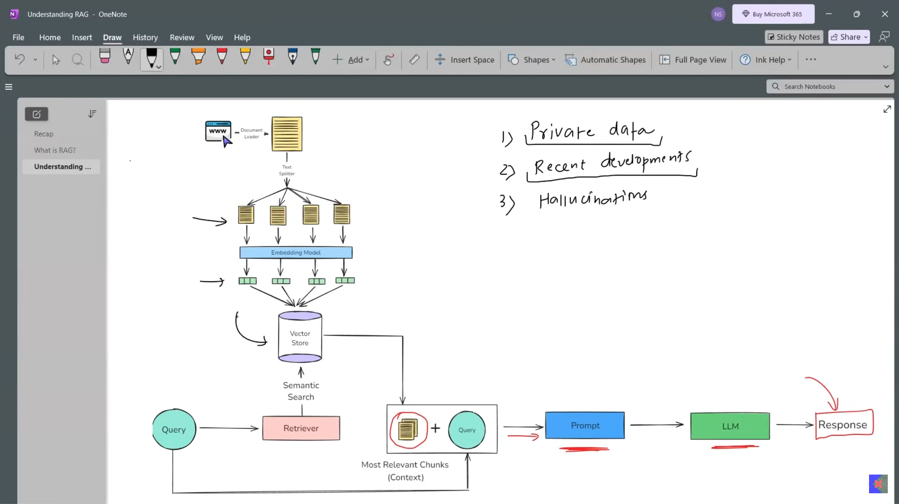
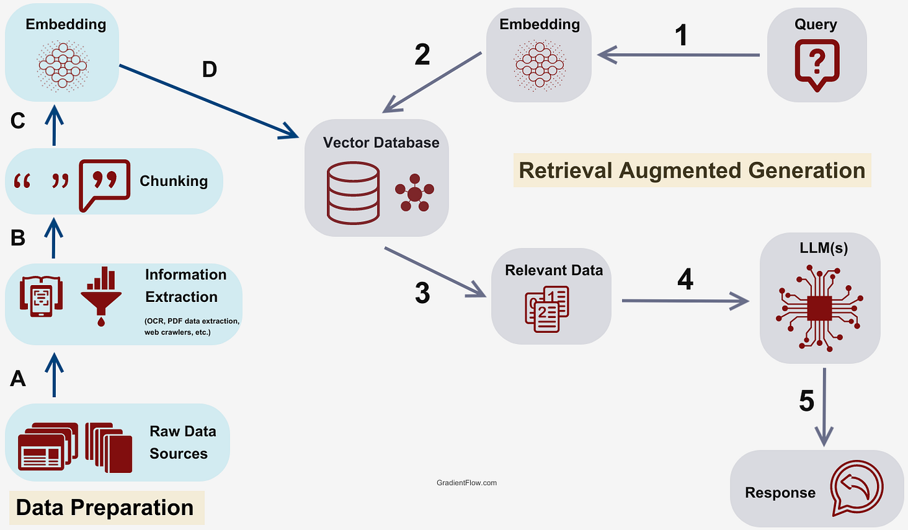
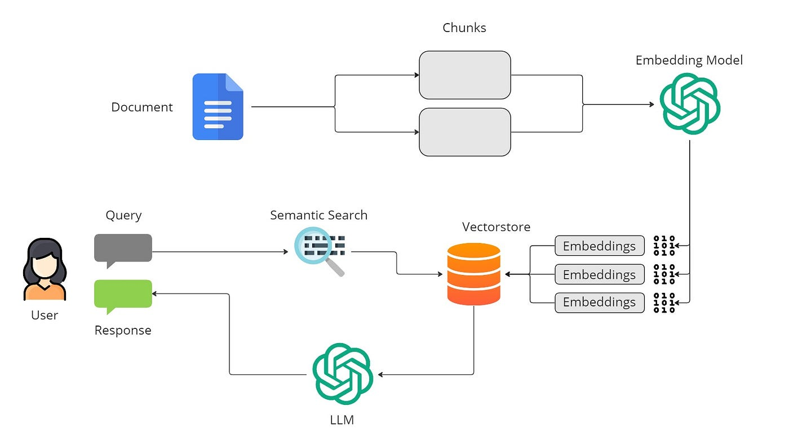
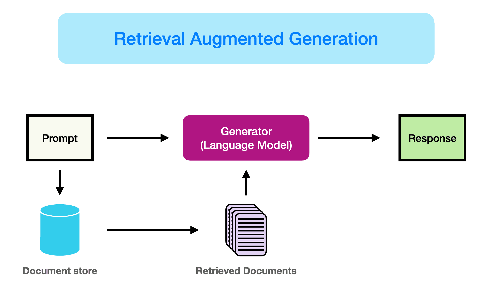
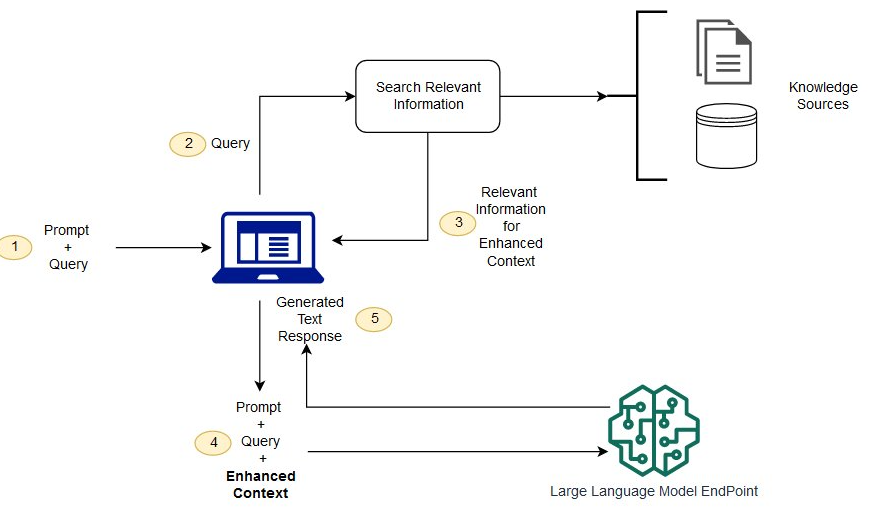

# Day_016 | 📝 Retrieval-Augmented Generation (RAG) Explained

**Retrieval-Augmented Generation (RAG)** is a powerful architectural framework that enhances the capability of Large Language Models (LLMs) by giving them access to **external, verifiable, and up-to-date knowledge bases**.

Essentially, RAG gives the LLM a "fact-checker" and an "encyclopedia" that is separate from its static training data.

### 🎯 What Problems Does RAG Solve?

RAG addresses the two biggest limitations of a traditional, standalone LLM:

1.  **Hallucinations:** Traditional LLMs can generate factually incorrect information with high confidence because they are trying to predict the next word based only on patterns learned during training. RAG **grounds** the response in retrieved documents, reducing fabrication.
2.  **Knowledge Cut-off:** LLMs are limited to the data they were trained on (e.g., up to late 2023). They cannot answer questions about recent events, internal company policies, or proprietary data. RAG provides **current and domain-specific context**.
3.  **Cost:** RAG is significantly more **cost-effective** than retraining or continuously fine-tuning a massive LLM every time new data is available.

---

## ⚙️ How Does RAG Work? (The Two-Phase Process)

A RAG system operates in two main phases: **Indexing (Pre-processing)** and **Query (Runtime)**.

### Phase 1: Indexing (Creating the Knowledge Base)

This phase happens **offline** and prepares your proprietary data for efficient retrieval.

1.  **Load and Split:** Your source documents (PDFs, manuals, databases, websites) are loaded using **Document Loaders**. They are then broken down into smaller, semantically coherent pieces, called **chunks**, using **Text Splitters**.
2.  **Embeddings:** An **Embedding Model** (a specialized neural network) converts each text chunk into a dense vector (a list of floating-point numbers) that mathematically represents its semantic meaning.
3.  **Store:** These vectors, along with their original text and metadata, are stored and indexed in a **Vector Store** (or Vector Database), which is optimized for fast similarity search.

### Phase 2: Query (The Runtime Execution)

This phase happens **in real-time** when a user submits a question.

1.  **User Query Embedding:** The user's input query is also converted into a vector embedding using the **exact same** Embedding Model used during the Indexing Phase.
2.  **Retrieval:** The query vector is sent to the **Vector Store**. A **Retriever** performs a **similarity search** (usually cosine similarity) to find the $K$ stored document chunks whose vectors are closest to the query vector. These are the *most relevant* pieces of information.
3.  **Prompt Augmentation:** The RAG system (often managed by a framework like LangChain) takes the **original user query** and combines it with the **retrieved text chunks** to create a single, enhanced, or **augmented prompt**.
4.  **Generation:** The **Augmented Prompt** is sent to the Large Language Model (the Generator). The prompt typically instructs the LLM: *“Answer the following question based ONLY on the context provided below. If the context does not contain the answer, state that you do not know.”*
5.  **Final Response:** The LLM generates a grounded, factual, and coherent response based on the new context, often including citations to the source documents.


## 🛠️ Components of a RAG System

A RAG system is a chain of specialized components working together:

| Component | Role in RAG | LangChain Component |
| :--- | :--- | :--- |
| **Knowledge Base** | The external repository of data (e.g., PDFs, databases). | **Document Loaders, Text Splitters.** |
| **Embedding Model** | Converts text to numerical vectors for semantic understanding. | **Embeddings.** |
| **Vector Store** | Stores and indexes the vectors for fast retrieval. | **Vector Stores** (e.g., Chroma, Pinecone). |
| **Retriever** | Performs the similarity search logic and fetches the relevant chunks. | **Retrievers** (e.g., `VectorStoreRetriever`). |
| **Generator** | The Large Language Model that synthesizes the final answer. | **LLMs / ChatModels.** |
| **Integrator/Orchestrator** | Coordinates all steps (retrieval, augmentation, generation). | **LangChain (Chains / LCEL).** |

### 🔎 Retrieval-Augmented Generation (RAG) — Explained Simply

**Retrieval-Augmented Generation (RAG)** is an AI architecture that combines **information retrieval** with **text generation** to produce **more accurate, up-to-date, and trustworthy responses**.

---

## 🧠 What Is RAG?

**RAG = Retrieval + Generation**

* **Retrieval**: Find relevant information from a knowledge source (documents, databases, PDFs, APIs, etc.)
* **Generation**: Use a Large Language Model (LLM) to generate an answer based on the retrieved information

📌 This approach helps overcome common LLM issues like **hallucinations**, **outdated knowledge**, and **lack of domain-specific data**.

---

## ⚙️ How Does RAG Work? (Step-by-Step)

### 1️⃣ User Query

A user asks a question:

> *“What are the side effects of Drug X?”*

---

### 2️⃣ Embedding the Query

* The query is converted into a **vector embedding** (numerical representation of meaning).

---

### 3️⃣ Retrieval from Knowledge Base

* The query embedding is compared with stored document embeddings in a **vector database** (e.g., FAISS, Pinecone, Weaviate).
* The system retrieves the **most relevant documents or text chunks**.

---

### 4️⃣ Context Injection

* Retrieved content is added to the LLM prompt as **context**.

---

### 5️⃣ Response Generation

* The LLM generates an answer using:

  * The retrieved context
  * Its language understanding abilities

✅ The result is **grounded, accurate, and explainable output**.

---

## 🧩 RAG Architecture (High-Level)

```
User Query
     ↓
Embedding Model
     ↓
Vector Database (Retrieval)
     ↓
Relevant Documents
     ↓
LLM (Prompt + Context)
     ↓
Final Answer
```

---

## 🚀 Why Use RAG?

### ✅ Key Benefits

* **Reduces hallucinations**
* **Uses private or proprietary data**
* **Keeps responses up to date**
* **No need to retrain the model**
* **Improves factual accuracy**

---

## 🆚 RAG vs Fine-Tuning

| Feature                 | RAG                   | Fine-Tuning              |
| ----------------------- | --------------------- | ------------------------ |
| Uses external data      | ✅ Yes                 | ❌ No                     |
| Data updates            | Easy                  | Expensive                |
| Hallucination reduction | High                  | Medium                   |
| Training cost           | Low                   | High                     |
| Best for                | Knowledge-heavy tasks | Style & behavior changes |

---

## 🏗️ Common RAG Use Cases

* 📄 Document Q&A (PDFs, manuals, policies)
* 🧑‍⚖️ Legal & compliance assistants
* 🏥 Healthcare knowledge systems
* 💬 Customer support chatbots
* 🧠 Enterprise knowledge search

---

## ⚠️ Challenges in RAG

* Poor chunking can hurt retrieval quality
* Retrieval latency
* Context window limits
* Requires good document embeddings

---

## 🛠️ Popular RAG Tools & Tech Stack

* **LLMs**: GPT, Claude, LLaMA
* **Embeddings**: OpenAI, SentenceTransformers
* **Vector DBs**: FAISS, Pinecone, Milvus
* **Frameworks**: LangChain, LlamaIndex

---

## 🧪 Simple RAG Example (Conceptual)

```text
Question: "What is RAG?"
Retrieved Context: "RAG combines retrieval and generation..."
Answer: "RAG is an AI technique that..."
```

---

## 🧠 RAG in One Line

> **Retrieval-Augmented Generation enables LLMs to answer questions using real, relevant, external knowledge instead of guessing.**

---

## Images




