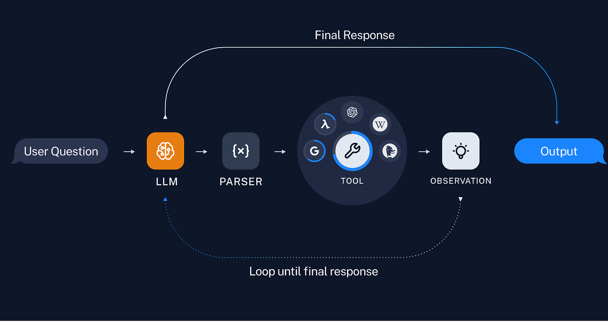
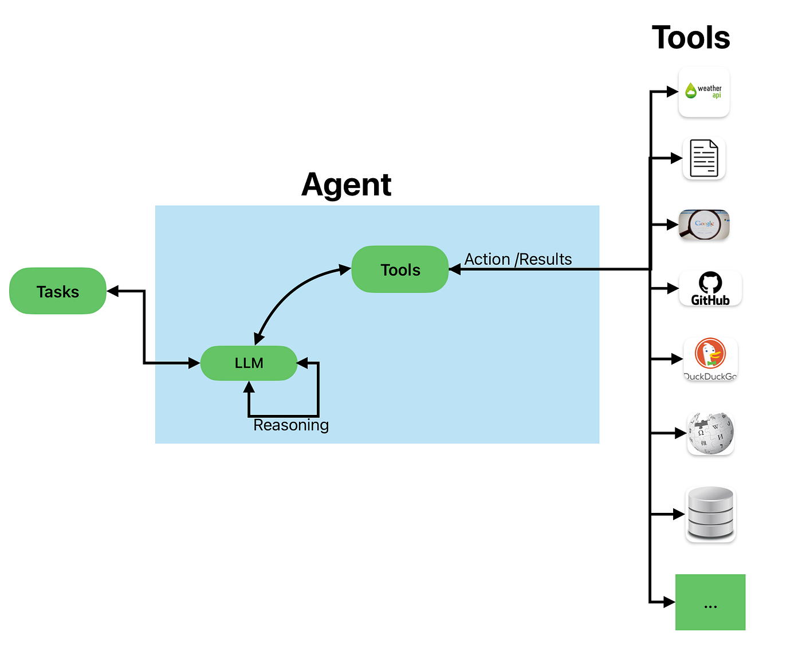
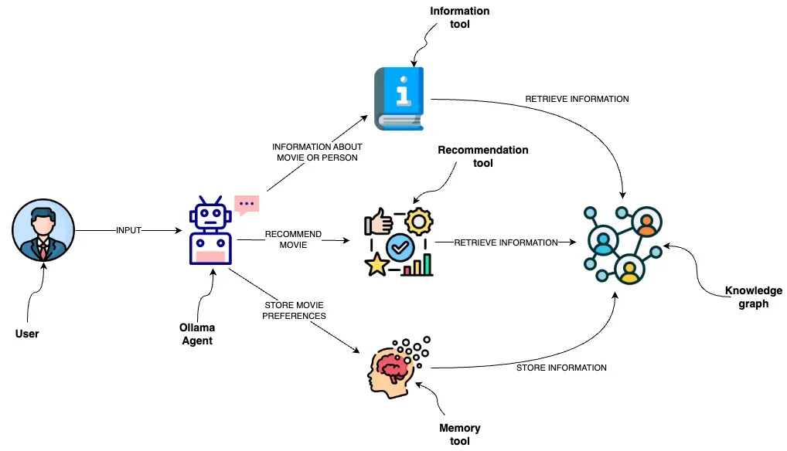

# Day_018 | 🛠️ Tools in LangChain

In LangChain, **Tools** are callable functions or utilities that **Agents** use to interact with the external world, retrieve real-time information, perform calculations, or execute code.

They are the essential components that extend the capabilities of Large Language Models (LLMs) far beyond their static training data and text generation.

### What is a Tool?

A Tool is essentially a standardized wrapper around a function that provides the LLM with three critical pieces of information:

1.  **Name:** A short, unique identifier (e.g., "google\_search", "calculator").
2.  **Function (`func`):** The actual Python function, API call, or logic to be executed.
3.  **Description:** A detailed, natural language description of what the tool does, its use cases, and what its input parameters are. **This description is crucial** because the LLM relies on it to decide *if* and *how* to call the tool.

### Why Tools are Necessary (The Agent Workflow)

Tools are the foundation of LangChain's **Agent** framework. An Agent is an LLM that uses a loop of **Reasoning** and **Acting** (often based on the ReAct pattern) to solve a complex problem.

The workflow is as follows:

1.  **Thought/Reasoning:** The Agent (LLM) reads the user's query and reasons about the next step: *"I need to know the current weather, so I should call the `get_weather` tool."*
2.  **Action/Tool Call:** The Agent calls the selected Tool with specific input parameters (e.g., `get_weather(city="London")`).
3.  **Observation/Result:** The Tool executes the function (e.g., calls a weather API) and returns the result (e.g., "The temperature is 18°C").
4.  **Final Answer:** The Agent uses the **Observation** to generate a final, grounded answer for the user.

### Types of Tools

LangChain offers a vast library of built-in tools and an easy way to define custom ones:

| Tool Category | Example Tools | Purpose |
| :--- | :--- | :--- |
| **Search & Information** | `TavilySearchResults`, `GoogleSearchAPIWrapper`, `WikipediaTool` | Provides **real-time or vast external knowledge** that the LLM was not trained on (e.g., current events, deep factual knowledge). |
| **Computation** | `PythonREPLTool`, `Calculator` | Allows the Agent to perform **accurate mathematical and logical operations**, overcoming the LLM's tendency to hallucinate simple math. |
| **Data Interaction** | `VectorStoreRetrieverTool`, `SQLDatabaseToolkit` | Enables the Agent to query internal or proprietary data sources (e.g., RAG systems, corporate databases) or execute code. |
| **Action & API Calls** | `RequestsWrapper`, `EmailTool` | Allows the Agent to **take real-world actions** like sending an email, booking a flight, or updating a record via an external API. |
| **Creative Generation** | `DalleTool` / `StableDiffusionTool` | Enables the Agent to **generate non-text output** (e.g., images) based on a prompt. |

### How to Implement Tools

LangChain makes creating a tool from a standard Python function straightforward, typically using the `@tool` decorator.

1.  **Use the `@tool` decorator:** This automatically converts your function into a Runnable tool.
2.  **Use Docstrings and Type Hints:** The function's docstring and Python type hints (`a: int`, `b: int`) are automatically used to generate the crucial **input schema and description** that the LLM reads.

<!-- end list -->

```python
from langchain.tools import tool

# The docstring and type hints define the tool's schema for the LLM
@tool
def multiply(a: int, b: int) -> int:
    """Multiplies two numbers together."""
    return a * b

# Usage: This tool can now be passed to an AgentExecutor
# tools = [multiply]
# agent = create_tool_calling_agent(llm, tools, prompt)
```

### Toolkits

A **Toolkit** is simply a curated collection of related tools meant to be used together for a specific domain (e.g., an `SQLDatabaseToolkit` contains tools for querying the database schema, executing SQL, and listing tables). This simplifies the agent setup for common tasks.

---

## 1. **What is a Tool in LangChain?**

A **tool** is essentially a wrapper around a function or service that can be invoked by an agent. Each tool has:

* **Name** – Used by the agent to identify the tool.
* **Function/Callable** – The actual action the tool performs (e.g., search a database, send an API request, do math).
* **Description** – Explains when and why to use the tool (helps the agent decide which tool to call).

**Example of a simple tool:**

```python
from langchain.tools import Tool

def add_numbers(a: int, b: int) -> int:
    return a + b

add_tool = Tool(
    name="Adder",
    func=add_numbers,
    description="Adds two numbers together."
)
```

---

## 2. **What is a Toolkit?**

A **toolkit** is a **collection of tools** bundled together, usually for a specific purpose or domain. Think of it like a “plugin pack” for an agent.

* Toolkits help organize tools for easier use.
* LangChain provides several pre-built toolkits, like:

  * **SerpAPI Toolkit** – For web searches
  * **Python REPL Toolkit** – For Python code execution
  * **SQL Database Toolkit** – For querying databases
  * **Google Search/Sheets Toolkits** – For Google API interactions

**Example:**

```python
from langchain.agents import initialize_agent, Tool
from langchain.agents import AgentType
from langchain.utilities import SerpAPIWrapper

search = SerpAPIWrapper()
search_tool = Tool(
    name="Search",
    func=search.run,
    description="Use this tool to answer questions by searching the web."
)

tools = [search_tool]

agent = initialize_agent(
    tools,
    llm,   # Your language model
    agent=AgentType.ZERO_SHOT_REACT_DESCRIPTION,
    verbose=True
)
```

Here, the `tools` list acts like a mini-toolkit.

---

## 3. **Pre-Built LangChain Toolkits**

LangChain provides a modular way to quickly integrate multiple tools via toolkits. Some common toolkits:

| Toolkit                    | Purpose                                               |
| -------------------------- | ----------------------------------------------------- |
| **SerpAPI Toolkit**        | Web search capability for answering factual questions |
| **Python REPL Toolkit**    | Run Python code and return results                    |
| **SQL Database Toolkit**   | Query SQL databases using natural language            |
| **OpenWeatherMap Toolkit** | Get current weather data                              |
| **Requests Toolkit**       | Make HTTP requests to APIs                            |
| **Document QA Toolkit**    | Perform question-answering over documents             |

Each toolkit internally contains **multiple tools** that the agent can choose from based on the question asked.

---

## 4. **How Agents Use Toolkits**

* The agent receives a **user input**.
* It decides **which tool(s) in the toolkit to call**.
* Executes the tool(s) and returns the **final answer**.

Think of the toolkit as the **agent's toolbox**, and each tool as a **specific instrument** for solving a problem.

---

## ✅ Key Takeaways:

1. **Tool** = Single action the agent can perform.
2. **Toolkit** = A collection of tools, often for a specific domain.
3. **Agents** = Use toolkits to handle tasks intelligently.
4. Toolkits simplify the process of giving agents multiple capabilities at once.

---

## References
https://docs.langchain.com/oss/python/integrations/chat

## Images


