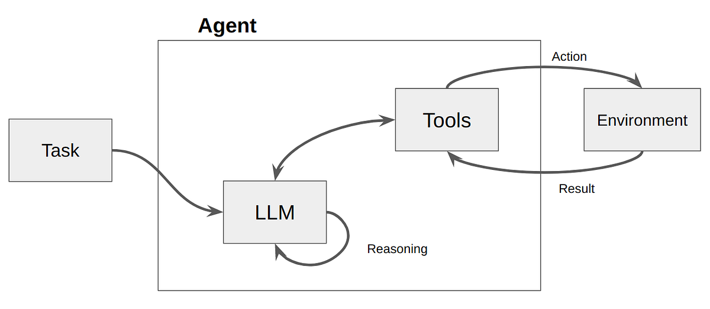
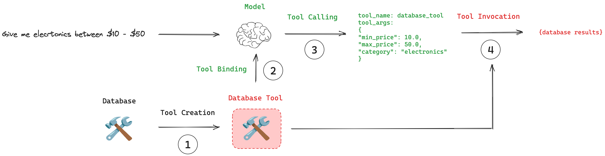

# Day_019 | 📞 Tool Calling in LangChain: The Step-by-Step Process

Tool calling (often called function calling) is the mechanism that allows a Large Language Model (LLM) to select and invoke external code or APIs to perform specific, factual actions.

In LangChain, this process is standardized and follows a clear, four-step workflow: **Creation, Binding, Calling, and Execution**.

---

### Step 1:Tool Creation (Defining the Capability)This is the initial step where you define the function that the LLM will be allowed to use. The key is providing a precise, machine-readable schema.

* **Action:** Write a standard Python function and wrap it with a LangChain tool utility (like the `@tool` decorator).
* **Schema Generation:** The tool automatically generates a JSON schema from the function's name, description (from the docstring), and type hints (for arguments).
* **Name:** `get_weather`
* **Description:** "Fetches the current weather for a specified city."
* **Arguments:** `city: str` (automatically derived from the function signature).


* **Result:** A `Tool` object containing the callable function and its explicit schema.

### Step 2: Tool Binding (Linking the Tools to the Model)The defined tools must be explicitly made available to the LLM so it knows what capabilities it possesses.

* **Action:** Use the Chat Model's `.bind_tools()` method, passing the list of `Tool` objects created in Step 1.
* **Information Transfer:** LangChain sends the generated JSON schemas of the tools to the LLM provider's API.
* **Result:** A new instance of the Chat Model (`model_with_tools`) that is configured with the internal knowledge of all available tools, their names, and their required input formats. The model now has the *option* to use these tools.

### Step 3: Tool Calling (LLM Reasoning and Output)This is the decision-making step, performed by the LLM itself based on the user's prompt.

* **Action:** The user sends a query to the `model_with_tools` (e.g., "What is the temperature in Tokyo right now?").
* **LLM Decision:** The model analyzes the query, references the tool schemas, and determines that the `get_weather` tool is necessary.
* **Tool Call Output:** Instead of returning a natural language answer, the LLM returns a structured **AIMessage** object containing a **tool call request**. This request specifies:
* The **Tool Name** (`get_weather`).
* The **Arguments** (e.g., `{"city": "Tokyo"}`) formatted according to the required schema.


* **Crucial Point:** The model *does not* execute the tool; it only *requests* that the application execute it.

### Step 4: Execution and Observation (Running the Code)The application (LangChain or the Agent Executor) takes over to run the requested tool and feed the result back to the LLM. This forms the execution loop.

1. **Execution:** The application code receives the tool call request from the model's output. It looks up the actual Python function (`get_weather`) and invokes it using the arguments provided by the model (`{"city": "Tokyo"}`).
2. **Observation:** The tool function runs (e.g., calls the weather API) and returns the real-world result (e.g., "The weather in Tokyo is 12°C and cloudy.").
3. **Feedback Loop:** This result is wrapped in a **ToolMessage** object and sent **back** to the LLM as part of the conversation history.
4. **Final Generation:** The LLM receives the `ToolMessage` (the observation), uses this new, factual context to formulate a final, natural language response, and returns the final answer to the user.

In a fully realized **Agent** framework (e.g., using `AgentExecutor` or LangGraph), these last two steps (Calling and Execution) are automatically managed in a loop until the Agent is ready to provide a final, complete answer.

---

## 1️⃣ Create a Tool

A **tool** is just a function with:

* a **name**
* a **description**
* an **input schema**
* an **implementation**

LangChain tools can be created in a few ways.

### Option A: Using `@tool` decorator (most common)

```python
from langchain.tools import tool

@tool
def get_weather(city: str) -> str:
    """Get the current weather for a city."""
    return f"The weather in {city} is sunny"
```

Behind the scenes, LangChain:

* Inspects function signature
* Builds a JSON schema
* Wraps it as a `Tool` object

---

### Option B: Explicit `Tool` class

```python
from langchain.tools import Tool

def get_weather(city: str) -> str:
    return f"The weather in {city} is sunny"

weather_tool = Tool(
    name="get_weather",
    description="Get the current weather for a city",
    func=get_weather
)
```

✅ **Creation step output**:
A `Tool` object with metadata + callable function.

---

## 2️⃣ Bind Tools to the LLM

The LLM **does not know tools exist** until you bind them.

### Modern LangChain (LCEL style)

```python
from langchain_openai import ChatOpenAI

llm = ChatOpenAI(model="gpt-4o-mini")

llm_with_tools = llm.bind_tools([get_weather])
```

What happens internally:

* LangChain converts tools to **OpenAI function/tool schemas**
* These schemas are injected into the model call
* The LLM is now *aware* of available tools

✅ **Binding step output**:
A new LLM instance that can **request tool calls**

---

## 3️⃣ Tool Calling (Model Decides to Use a Tool)

Now the model receives user input.

```python
response = llm_with_tools.invoke("What is the weather in Paris?")
```

### What the LLM does internally

1. Reads the user query
2. Matches intent to tool descriptions
3. Decides **not to answer directly**
4. Returns a **tool call request**, not a final answer

Example model output (simplified):

```json
{
  "tool_calls": [
    {
      "name": "get_weather",
      "args": { "city": "Paris" }
    }
  ]
}
```

🚨 Important:

* **The tool is NOT executed yet**
* The LLM only *asks* for the tool

✅ **Calling step output**:\
A `ToolCall` object (structured request)

---

## 4️⃣ Tool Execution (Handled by LangChain)

LangChain now:

1. Reads the tool call
2. Finds the matching tool
3. Executes the Python function

```python
tool_call = response.tool_calls[0]
tool_result = get_weather.invoke(tool_call["args"])
```

Execution result:

```text
"The weather in Paris is sunny"
```

LangChain wraps this result as a **ToolMessage**.

✅ **Execution step output**:\
Raw tool result → `ToolMessage`

---

## 5️⃣ Return Tool Result to the LLM

The tool result is sent **back to the model** so it can reason or respond naturally.

```python
final_response = llm_with_tools.invoke([
    response,  # tool call
    tool_result  # tool output
])
```

Now the LLM produces a **final answer**:

```text
"The weather in Paris is sunny."
```

✅ **Final step output**:\
Human-readable answer

---

## 🔁 Full Lifecycle Summary

| Step        | Who Does It | What Happens               |
| ----------- | ----------- | -------------------------- |
| **Create**  | Developer   | Define function + metadata |
| **Bind**    | LangChain   | Attach tools to LLM        |
| **Call**    | LLM         | Chooses tool & arguments   |
| **Execute** | LangChain   | Runs Python function       |
| **Return**  | LLM         | Produces final answer      |

---

## 🔄 How Agents Automate This

When using an **Agent**, LangChain loops automatically:

```python
from langchain.agents import create_tool_calling_agent, AgentExecutor

agent = create_tool_calling_agent(llm, [get_weather])
executor = AgentExecutor(agent=agent, tools=[get_weather])

executor.invoke({"input": "What's the weather in Paris?"})
```

The agent:

* Calls tools
* Executes them
* Feeds results back
* Stops when done

No manual wiring required.

---

## 🧠 Mental Model (Very Important)

> **LLMs don’t run tools. They only ask for them.**
> **LangChain is the execution engine.**

---

## Images

